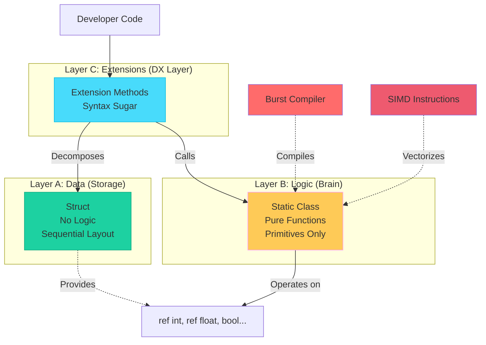

# Chapter 1: The Golden Rule – The Data-Logic-Extension Triad

> **"Separate what changes from what doesn't. Separate data from behavior. Separate the interface from the implementation."**

---

## Table of Contents

1. [The Problem with OOP in Game Engines](#the-problem-with-oop-in-game-engines)
2. [The Triad: An Overview](#the-triad-an-overview)
3. [Layer A: Pure Data (The Struct)](#layer-a-pure-data-the-struct)
4. [Layer B: Core Logic (The Static Class)](#layer-b-core-logic-the-static-class)
5. [Layer C: The Adapter (The Extension Class)](#layer-c-the-adapter-the-extension-class)
6. [Real-World Example: From OOP to DOD](#real-world-example-from-oop-to-dod)
7. [Why This Separation Matters](#why-this-separation-matters)
8. [Common Violations](#common-violations-and-how-to-fix-them)

---

## The Problem with OOP in Game Engines

Traditional Object-Oriented Programming (OOP) encourages bundling data and behavior together. In a standard enterprise app, that's fine. In a high-performance game engine like Unity, it's a performance killer.

Here's the classic OOP approach:

```csharp
// ❌ TRADITIONAL OOP APPROACH
public class Player
{
    public int Health { get; set; }
    public float Speed { get; set; }
    
    public void TakeDamage(int amount)
    {
        Health -= amount;
        if (Health <= 0)
        {
            Die();
        }
    }
    
    private void Die()
    {
        // Logic mixed with state
    }
}
```

### Why This Fails

1.  **Cache Misses:** Your CPU has to jump around memory to find the data it needs.
2.  **No SIMD:** You can't process multiple players at once because their data isn't contiguous.
3.  **GC Pressure:** Classes create garbage. Garbage collection causes frame spikes.
4.  **Not Burst-Compatible:** You can't use Unity's Burst compiler with standard classes.
5.  **Hard to Test:** Your logic is trapped inside the object, often coupled to Unity.

---

## The Triad: An Overview

The **Data-Logic-Extension Triad** is our solution. It's a strict architectural pattern that separates concerns at the language level.



### The Philosophy

1.  **Layer A (Data)** is just storage. It's dumb. It holds state in the most efficient way possible.
2.  **Layer B (Logic)** is the brain. It's a static class of pure functions. It doesn't know about your specific structs; it only knows about primitives (`int`, `float`, `bool`).
3.  **Layer C (Extensions)** is the glue. It makes the API nice to use for developers.

**Golden Rule:** Never mix these layers. Each has a single responsibility.

---

## Layer A: Pure Data (The Struct)

### Purpose
Store data in the most efficient format possible. Nothing more.

### The Rules

*   **Public fields only.** No properties with logic.
*   **No methods.** No `Update()`, no `Tick()`.
*   **Sequential Layout.** We want predictable memory.
*   **Blittable types only.** No strings, no classes, no lists.

### Template

```csharp
using System;
using System.Runtime.InteropServices;

[Serializable]
[StructLayout(LayoutKind.Sequential)]
public struct Health
{
    public int Current;
    public int Max;

    // ✅ Constructor is fine
    public Health(int max)
    {
        Current = max;
        Max = max;
    }

    // ✅ Getter-only property (no logic) is okay for convenience
    public readonly bool IsAlive => Current > 0;
    
    // ✅ Implicit operators are great for cleaner code
    public static implicit operator int(Health h) => h.Current;
}
```

---

## Layer B: Core Logic (The Static Class)

### Purpose
This is the "brain". It contains all the math, state mutations, and business rules.

### The Rules

*   **Static class only.** No instances.
*   **Primitives only.** Never pass the `Health` struct here. Pass `ref int current`.
*   **Pure functions.** Output depends only on input. No side effects.
*   **Burst compatible.** No managed objects, no LINQ, no allocations.

### Template

```csharp
using System.Runtime.CompilerServices;

public static class HealthLogic
{
    [MethodImpl(MethodImplOptions.AggressiveInlining)]
    public static bool TryApplyDamage(ref int current, int damage)
    {
        if (damage < 0) return false;
        if (current <= 0) return false;

        current -= damage;
        if (current < 0) current = 0;

        return current > 0;
    }

    [MethodImpl(MethodImplOptions.AggressiveInlining)]
    public static void Heal(ref int current, int max, int amount)
    {
        if (amount <= 0) return;
        if (current >= max) return;

        current += amount;
        if (current > max) current = max;
    }
}
```

**Why primitives?**
If you pass the whole struct, the compiler has to copy it (or pass a reference to the whole thing). If you pass just `ref int`, the compiler can load that specific value directly into a CPU register. This is critical for SIMD vectorization.

---

## Layer C: The Adapter (The Extension Class)

### Purpose
This layer exists for **Developer Experience (DX)**. It bridges the gap between your nice-looking structs and your high-performance logic.

### The Rules

*   **Extension methods only.**
*   **Decompose and delegate.** Take the struct, pull out the fields, and pass them to Layer B.
*   **No logic.** Do not write `if` statements here. Just pass data.

### Template

```csharp
public static class HealthExtensions
{
    public static bool TryApplyDamage(ref this Health health, int damage)
    {
        // Decompose struct -> primitives -> Logic Layer
        return HealthLogic.TryApplyDamage(ref health.Current, damage);
    }

    public static void Heal(ref this Health health, int amount)
    {
        HealthLogic.Heal(ref health.Current, health.Max, amount);
    }
}
```

### The Result
You get to write code that *looks* like OOP:

```csharp
playerHealth.TryApplyDamage(10);
```

But compiles down to raw, static, optimized machine code:

```csharp
HealthLogic.TryApplyDamage(ref playerHealth.Current, 10);
```

---

## Real-World Example: From OOP to DOD

### ❌ Before: OOP Style

```csharp
public class Cooldown
{
    private float current;
    private float max;

    public void Tick(float deltaTime)
    {
        if (current > 0)
        {
            current -= deltaTime;
            if (current < 0) current = 0;
        }
    }
}
```

**Problems:**
- Heap allocation (GC pressure).
- Instance method (not Burst-compatible).
- Mixed state and behavior.

### ✅ After: DOD Style

**1. Data**
```csharp
[Serializable]
[StructLayout(LayoutKind.Sequential)]
public struct Cooldown
{
    public float Current;
    public float Max;
}
```

**2. Logic**
```csharp
public static class CooldownLogic
{
    [MethodImpl(MethodImplOptions.AggressiveInlining)]
    public static void Tick(ref float current, float deltaTime)
    {
        if (current <= 0) return;
        current -= deltaTime;
        if (current < 0) current = 0;
    }
}
```

**3. Extensions**
```csharp
public static class CooldownExtensions
{
    public static void Tick(ref this Cooldown c, float deltaTime)
    {
        CooldownLogic.Tick(ref c.Current, deltaTime);
    }
}
```

---

## Why This Separation Matters

1.  **Burst Compatibility:** Logic methods operate on primitives, so they are trivially compatible with Unity's Burst compiler.
2.  **SIMD Vectorization:** Because we work with primitives, the compiler can auto-vectorize operations (processing 4-8 items at once).
3.  **Zero Allocations:** Structs live on the stack or in native arrays. No garbage collection.
4.  **Testability:** You can unit test `CooldownLogic` without starting Unity. It's just C# math.

---

## Common Violations

### 1. Logic in Struct
**Don't do this:**
```csharp
public struct Timer {
    public void Tick() { ... } // ❌ Logic in struct
}
```
**Fix:** Move `Tick` to `TimerLogic`.

### 2. Passing Struct to Logic
**Don't do this:**
```csharp
public static void Heal(ref Health h) { ... } // ❌ Passing struct
```
**Fix:** Pass `ref int current, int max`.

### 3. Logic in Extensions
**Don't do this:**
```csharp
public static void Tick(ref this Timer t) {
    t.Current -= Time.deltaTime; // ❌ Logic in extension
}
```
**Fix:** Delegate to `TimerLogic.Tick`.

---

**Next:** [Chapter 2: Control Flow - The Early Exit Pattern →](./02-early-exit-pattern.md)
