# Chapter 1: The Golden Rule – The Data-Logic-Extension Triad

> **"Separate what changes from what doesn't. Separate data from behavior. Separate the interface from the implementation."**  
> — *The Three Pillars of Data-Oriented Design*

---

## Table of Contents

1. [The Problem with OOP in Game Engines](#the-problem-with-oop-in-game-engines)
2. [The Triad: An Overview](#the-triad-an-overview)
3. [Layer A: Pure Data (The Struct)](#layer-a-pure-data-the-struct)
4. [Layer B: Core Logic (The Static Class)](#layer-b-core-logic-the-static-class)
5. [Layer C: The Adapter (The Extension Class)](#layer-c-the-adapter-the-extension-class)
6. [Real-World Example: From OOP to DOD](#real-world-example-from-oop-to-dod)
7. [Why This Separation Matters](#why-this-separation-matters)
8. [Common Violations and How to Fix Them](#common-violations-and-how-to-fix-them)

---

## The Problem with OOP in Game Engines

Traditional Object-Oriented Programming encourages bundling data and behavior together:

```csharp
// ❌ TRADITIONAL OOP APPROACH
public class Player
{
    public int Health { get; set; }
    public float Speed { get; set; }
    
    public void TakeDamage(int amount)
    {
        Health -= amount;
        if (Health <= 0)
        {
            Die();
        }
    }
    
    private void Die()
    {
        // Logic mixed with state
    }
}
```

### Why This Fails in High-Performance Games

| Problem | Impact |
|---------|--------|
| **Cache Misses** | CPU fetches vtable pointers and scattered memory |
| **No SIMD** | Can't vectorize operations across multiple entities |
| **GC Pressure** | Classes create heap allocations |
| **Not Burst-Compatible** | Instance methods can't be Burst-compiled |
| **Hard to Test** | Logic is coupled to Unity's runtime |

### Memory Layout Disaster: OOP vs DOD

#### ❌ OOP Class Layout (Scattered in Memory)

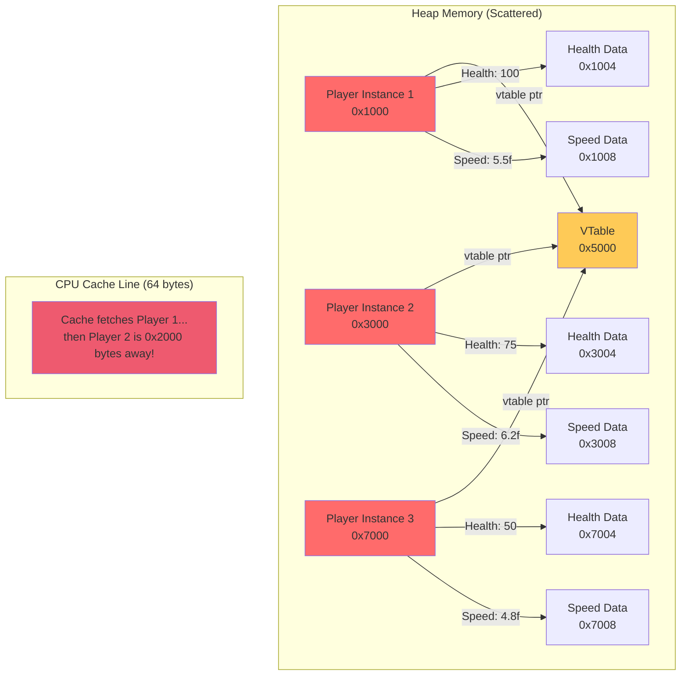

**Problem:** Each player object is scattered across the heap. Accessing 1000 players = 1000 cache misses.

---

#### ✅ DOD Struct Layout (Sequential in Memory)

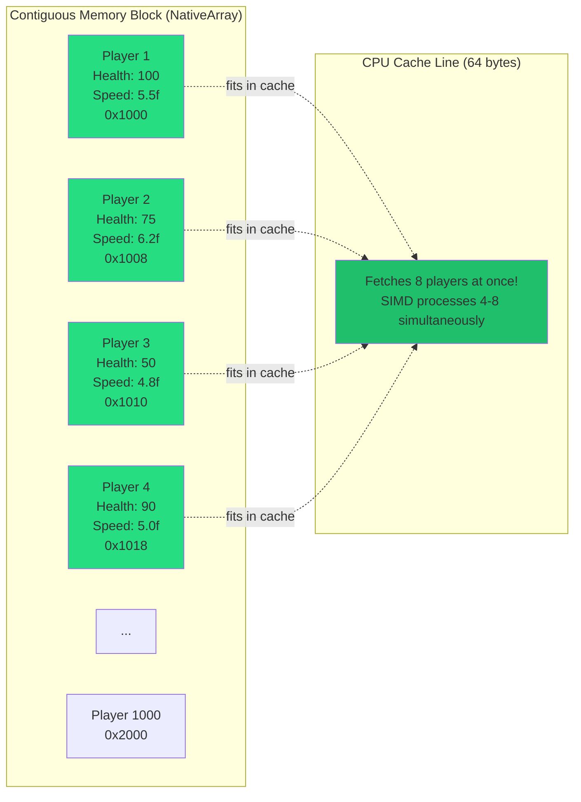

**Benefit:** Sequential layout = CPU prefetches entire cache lines. Processing 1000 players ≈ 125 cache loads.

---

## The Triad: An Overview

The **Data-Logic-Extension Triad** is a strict architectural pattern that enforces separation of concerns at the language level.

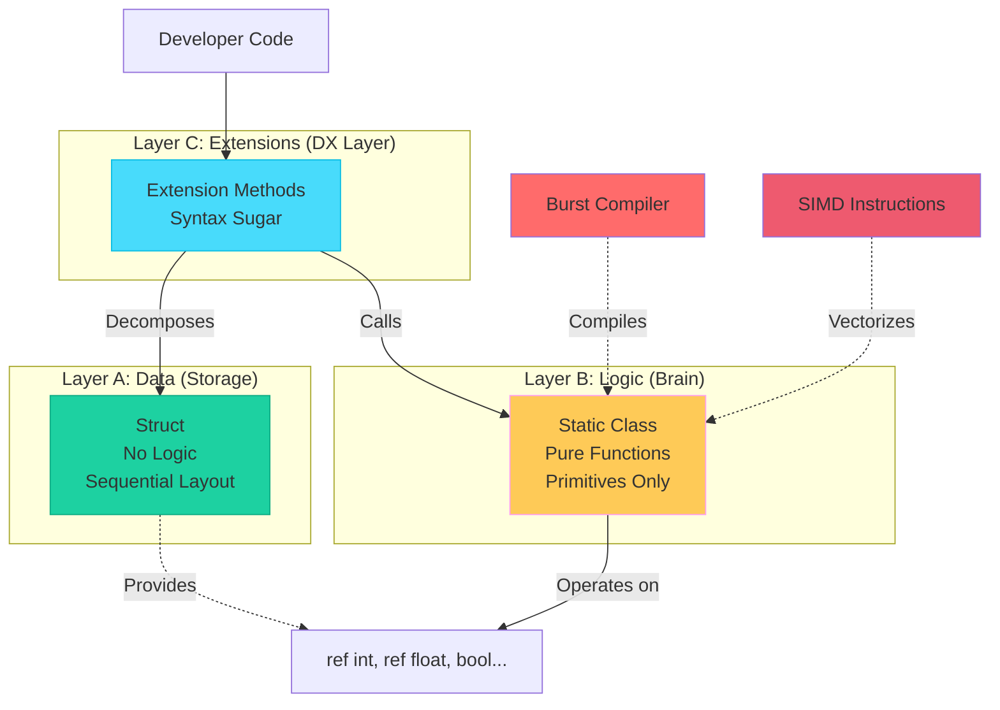

### Design Philosophy

1. **Layer A** stores data in cache-friendly, blittable structs
2. **Layer B** operates on primitives using pure functions
3. **Layer C** provides ergonomic syntax by bridging A and B

**Golden Rule:** Never mix these layers. Each has a single responsibility.

### Data Flow Visualization

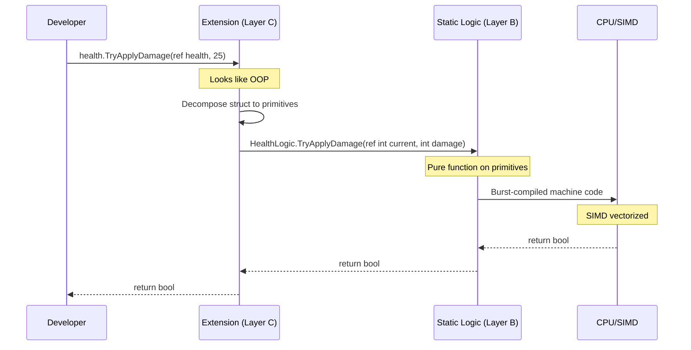

---

## Layer A: Pure Data (The Struct)

### Purpose
Store data in the most efficient format possible. Nothing more.

### Rules

| ✅ Allowed | ❌ Forbidden |
|-----------|-------------|
| Public fields | Instance methods with logic |
| Constructors | Mutable properties with logic |
| Implicit operators | Events or delegates |
| Getter-only properties | References to managed objects |
| Explicit interface implementations | Virtual or abstract members |

### Template

```csharp
using System;
using System.Runtime.InteropServices;

[Serializable]
[StructLayout(LayoutKind.Sequential)]
public struct Health
{
    public int Current;
    public int Max;

    // ✅ Constructor is fine
    public Health(int max)
    {
        Current = max;
        Max = max;
    }

    // ✅ Getter-only property (no logic)
    public readonly bool IsAlive => Current > 0;

    // ✅ Implicit operator for convenience
    public static implicit operator int(Health h) => h.Current;
}
```

### Why Sequential Layout?

```csharp
[StructLayout(LayoutKind.Sequential)]
```

This attribute:
- **Guarantees predictable memory layout** for Burst and Jobs
- **Enables memcpy optimization** for batch operations
- **Prevents C# compiler reordering** fields for alignment

#### Memory Layout Comparison

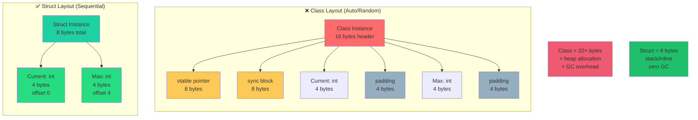

**Sequential Layout Benefits:**

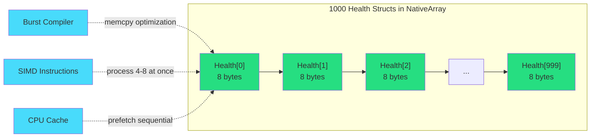

---

## Layer B: Core Logic (The Static Class)

### Purpose
Contain all computation and state mutation. This is the "brain" of your system.

### Rules

| ✅ Required | ❌ Forbidden |
|------------|-------------|
| Static class | Instance methods |
| Primitive parameters only | Struct parameters |
| Pure functions | Accessing global state |
| `ref`/`out` for mutation | LINQ or allocations |
| `[MethodImpl(AggressiveInlining)]` | Managed types in signatures |

### Template

```csharp
using System.Runtime.CompilerServices;

public static class HealthLogic
{
    /// <summary>
    /// Reduces health by the specified damage amount.
    /// </summary>
    /// <param name="current">Current health value</param>
    /// <param name="damage">Damage to apply</param>
    /// <returns>True if entity is still alive after damage</returns>
    [MethodImpl(MethodImplOptions.AggressiveInlining)]
    public static bool TryApplyDamage(ref int current, int damage)
    {
        if (damage < 0) return false;
        if (current <= 0) return false;

        current -= damage;
        if (current < 0) current = 0;

        return current > 0;
    }

    /// <summary>
    /// Restores health up to maximum.
    /// </summary>
    [MethodImpl(MethodImplOptions.AggressiveInlining)]
    public static void Heal(ref int current, int max, int amount)
    {
        if (amount <= 0) return;
        if (current >= max) return;

        current += amount;
        if (current > max) current = max;
    }

    /// <summary>
    /// Checks if health is critically low.
    /// </summary>
    [MethodImpl(MethodImplOptions.AggressiveInlining)]
    public static bool IsCritical(int current, int max)
    {
        if (max <= 0) return true;
        return current <= max * 0.25f;
    }
}
```

### Key Principles

#### 1. Primitives Only
```csharp
// ❌ WRONG - Passing struct
public static void Heal(ref Health health) { }

// ✅ CORRECT - Passing primitives
public static void Heal(ref int current, int max, int amount) { }
```

#### 2. Early Exit Pattern (See Chapter 2)
```csharp
public static bool TryApplyDamage(ref int current, int damage)
{
    if (damage < 0) return false;  // ✅ Validate and exit early
    if (current <= 0) return false; // ✅ Guard clause
    
    current -= damage; // Main logic
    return current > 0;
}
```

#### 3. Aggressive Inlining
```csharp
[MethodImpl(MethodImplOptions.AggressiveInlining)]
```
This hint tells the JIT/Burst compiler to inline the method body at the call site, eliminating function call overhead.

---

## Layer C: The Adapter (The Extension Class)

### Purpose
Provide ergonomic developer experience (DX) by bridging structs and logic.

### Rules

| ✅ Allowed | ❌ Forbidden |
|-----------|-------------|
| Extension methods only | Instance fields |
| Decompose struct → primitives | Logic implementation |
| Call Layer B methods | Direct struct mutation |
| Interface bridging | Allocations |

### Template

```csharp
public static class HealthExtensions
{
    /// <summary>
    /// Applies damage to this health instance.
    /// </summary>
    public static bool TryApplyDamage(ref this Health health, int damage)
    {
        return HealthLogic.TryApplyDamage(ref health.Current, damage);
    }

    /// <summary>
    /// Heals this health instance.
    /// </summary>
    public static void Heal(ref this Health health, int amount)
    {
        HealthLogic.Heal(ref health.Current, health.Max, amount);
    }

    /// <summary>
    /// Checks if health is critically low.
    /// </summary>
    public static bool IsCritical(this Health health)
    {
        return HealthLogic.IsCritical(health.Current, health.Max);
    }
}
```

### Why Extensions?

Extensions allow you to write code that **looks like OOP but executes like DOD**:

```csharp
// Usage looks natural
Health player = new Health(100);

if (player.TryApplyDamage(ref player, 25))
{
    Debug.Log("Player took damage!");
}

if (player.IsCritical())
{
    Debug.Log("Health critical!");
}

player.Heal(ref player, 50);
```

But under the hood, it's calling **static methods on primitives**:
```csharp
// What actually happens
HealthLogic.TryApplyDamage(ref player.Current, 25);
HealthLogic.IsCritical(player.Current, player.Max);
HealthLogic.Heal(ref player.Current, player.Max, 50);
```

---

## Real-World Example: From OOP to DOD

### ❌ Before: OOP Style

```csharp
public class Cooldown
{
    private float current;
    private float max;

    public Cooldown(float duration)
    {
        current = duration;
        max = duration;
    }

    public void Tick(float deltaTime)
    {
        if (current > 0)
        {
            current -= deltaTime;
            if (current < 0) current = 0;
        }
    }

    public bool IsReady() => current <= 0;

    public void Reset() => current = max;
}
```

**Problems:**
- ❌ Class allocation (GC pressure)
- ❌ Instance methods (not Burst-compatible)
- ❌ Mixed state and behavior
- ❌ Can't SIMD across multiple cooldowns

---

### ✅ After: DOD Style

#### Layer A: The Data
```csharp
using System;
using System.Runtime.InteropServices;

[Serializable]
[StructLayout(LayoutKind.Sequential)]
public struct Cooldown
{
    public float Current;
    public float Max;

    public Cooldown(float duration)
    {
        Current = duration;
        Max = duration;
    }

    public readonly bool IsReady => Current <= 0;
}
```

#### Layer B: The Logic
```csharp
using System.Runtime.CompilerServices;

public static class CooldownLogic
{
    [MethodImpl(MethodImplOptions.AggressiveInlining)]
    public static void Tick(ref float current, float deltaTime)
    {
        if (current <= 0) return;
        
        current -= deltaTime;
        if (current < 0) current = 0;
    }

    [MethodImpl(MethodImplOptions.AggressiveInlining)]
    public static void Reset(ref float current, float max)
    {
        current = max;
    }

    [MethodImpl(MethodImplOptions.AggressiveInlining)]
    public static bool IsReady(float current)
    {
        return current <= 0;
    }
}
```

#### Layer C: The Extensions
```csharp
public static class CooldownExtensions
{
    public static void Tick(ref this Cooldown c, float deltaTime)
    {
        CooldownLogic.Tick(ref c.Current, deltaTime);
    }

    public static void Reset(ref this Cooldown c)
    {
        CooldownLogic.Reset(ref c.Current, c.Max);
    }
}
```

---

## Why This Separation Matters

### 1. **Burst Compatibility**
All logic methods can be Burst-compiled because they operate on primitives:

```csharp
[BurstCompile]
public struct CooldownJob : IJobParallelFor
{
    public NativeArray<float> Cooldowns;
    public float DeltaTime;

    public void Execute(int index)
    {
        float current = Cooldowns[index];
        CooldownLogic.Tick(ref current, DeltaTime); // ✅ Burst-compiled
        Cooldowns[index] = current;
    }
}
```

### 2. **SIMD Vectorization**
Burst can auto-vectorize primitive operations:

```csharp
// Processes 4-8 cooldowns simultaneously using SIMD
for (int i = 0; i < 1000; i++)
{
    CooldownLogic.Tick(ref cooldowns[i], deltaTime);
}
```

#### SIMD Visualization

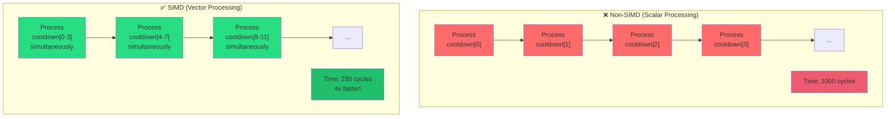

**How SIMD Works on Primitives:**

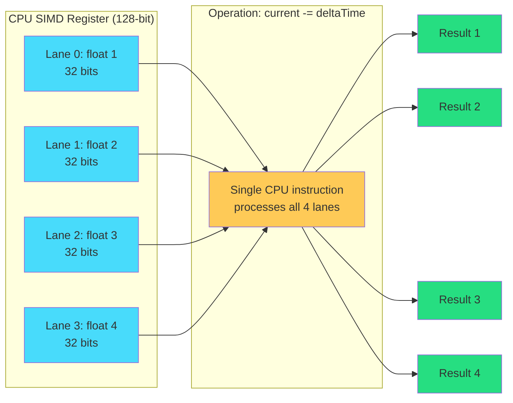

**Why This Only Works with Primitives:**
- ✅ `ref float` → CPU can load into SIMD registers
- ❌ `ref Cooldown` → Struct contains multiple fields, can't vectorize

### 3. **Zero Allocations**
Structs are stack-allocated or inlined into containers:

```csharp
NativeArray<Cooldown> cooldowns = new NativeArray<Cooldown>(1000, Allocator.Persistent);
// Zero GC allocations
```

### 4. **Testable Without Unity**
Logic classes have zero dependencies:

```csharp
[Test]
public void CooldownLogic_TicksDownCorrectly()
{
    float current = 5f;
    CooldownLogic.Tick(ref current, 1f);
    Assert.AreEqual(4f, current);
}
```

### 5. **Cache-Friendly**
Sequential data layout improves cache hit rates:

```mermaid
graph TD
    subgraph "CPU L1 Cache (64-byte cache lines)"
        CL1["Cache Line 1<br/>Cooldown[0-7]"]
        CL2["Cache Line 2<br/>Cooldown[8-15]"]
        CL3["Cache Line 3<br/>Cooldown[16-23]"]
    end
    
    subgraph "RAM (NativeArray&lt;Cooldown&gt;)"
        direction LR
        C0["C[0]<br/>8 bytes"] --> C1["C[1]"]
        C1 --> C2["C[2]"]
        C2 --> C3["C[3]"]
        C3 --> C4["C[4]"]
        C4 --> C5["C[5]"]
        C5 --> C6["C[6]"]
        C6 --> C7["C[7]"]
        C7 --> C8["C[8]"]
        C8 --> C9["..."]
    end
    
    C0 -.->|Single fetch loads 8 structs| CL1
    C8 -.->|Next fetch| CL2
    
    CPU["CPU Core"] -->|Reads C[0]| CL1
    CPU -->|C[1] already cached!| CL1
    CPU -->|C[2] already cached!| CL1
    CPU -->|C[7] already cached!| CL1
    
    style CL1 fill:#1dd1a1
    style CL2 fill:#1dd1a1
    style CL3 fill:#1dd1a1
    style CPU fill:#48dbfb
```

**Memory Layout Details:**

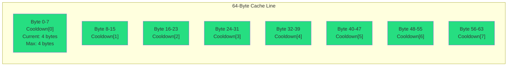

**Performance Impact:**
- **OOP (classes)**: 1000 cooldowns = ~1000 cache misses = ~300,000 CPU cycles
- **DOD (structs)**: 1000 cooldowns = ~125 cache loads = ~37,500 CPU cycles
- **Result**: **8x faster** just from memory layout!

---

## Common Violations and How to Fix Them

### Violation 1: Logic in Struct

```csharp
// ❌ WRONG
public struct Timer
{
    public float Current;
    
    public void Tick(float dt)
    {
        Current -= dt; // Logic in struct!
    }
}
```

**Fix:**
```csharp
// ✅ CORRECT
public struct Timer
{
    public float Current;
}

public static class TimerLogic
{
    public static void Tick(ref float current, float dt)
    {
        current -= dt;
    }
}

public static class TimerExtensions
{
    public static void Tick(ref this Timer t, float dt)
    {
        TimerLogic.Tick(ref t.Current, dt);
    }
}
```

---

### Violation 2: Passing Struct to Logic

```csharp
// ❌ WRONG
public static class HealthLogic
{
    public static void Heal(ref Health health) // Passing struct!
    {
        health.Current = health.Max;
    }
}
```

**Fix:**
```csharp
// ✅ CORRECT
public static class HealthLogic
{
    public static void Heal(ref int current, int max)
    {
        current = max;
    }
}
```

---

### Violation 3: Extensions Contain Logic

```csharp
// ❌ WRONG
public static class TimerExtensions
{
    public static void Tick(ref this Timer t, float dt)
    {
        // Logic implemented directly in extension!
        if (t.Current > 0)
        {
            t.Current -= dt;
        }
    }
}
```

**Fix:**
```csharp
// ✅ CORRECT
public static class TimerExtensions
{
    public static void Tick(ref this Timer t, float dt)
    {
        TimerLogic.Tick(ref t.Current, dt); // Delegate to Layer B
    }
}
```

---

## Summary

The **Data-Logic-Extension Triad** is the foundation of high-performance DOD architecture:

| Layer | Type | Responsibility | Key Constraint |
|-------|------|----------------|----------------|
| **A** | `struct` | Store data | No logic methods |
| **B** | `static class` | Perform computation | Primitives only |
| **C** | `static class` (extensions) | Developer ergonomics | Decompose & delegate |

### The Complete Architecture Flow

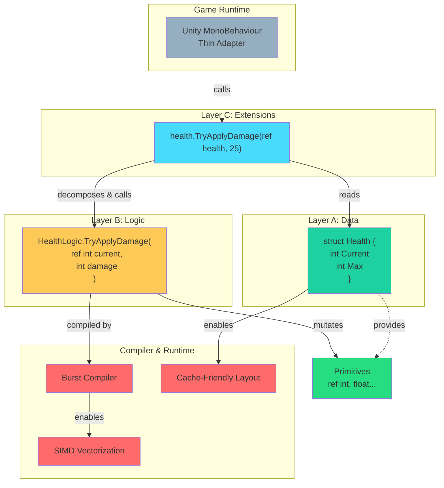

### Performance Comparison Summary

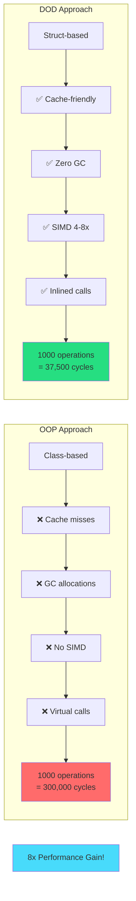

### The Mental Model

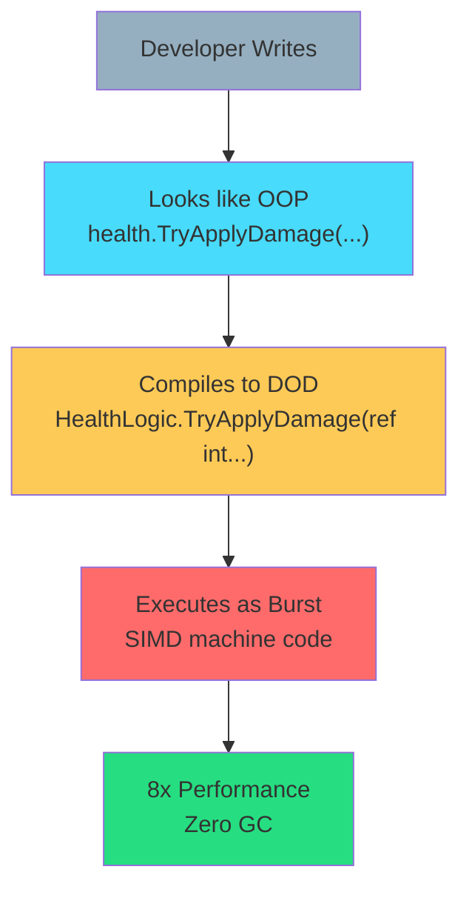

**Next:** [Chapter 2: Control Flow - The Early Exit Pattern →](./02-early-exit-pattern.md)

---

## Quick Reference

```csharp
// LAYER A: Pure Data
[Serializable]
[StructLayout(LayoutKind.Sequential)]
public struct MyData
{
    public int Value;
    public readonly bool IsValid => Value > 0;
}

// LAYER B: Pure Logic
public static class MyDataLogic
{
    [MethodImpl(MethodImplOptions.AggressiveInlining)]
    public static bool TryProcess(ref int value)
    {
        if (value <= 0) return false;
        value *= 2;
        return true;
    }
}

// LAYER C: Developer Experience
public static class MyDataExtensions
{
    public static bool TryProcess(ref this MyData data)
    {
        return MyDataLogic.TryProcess(ref data.Value);
    }
}
```

---

*This chapter establishes the architectural foundation. All subsequent patterns build upon this triad.*
