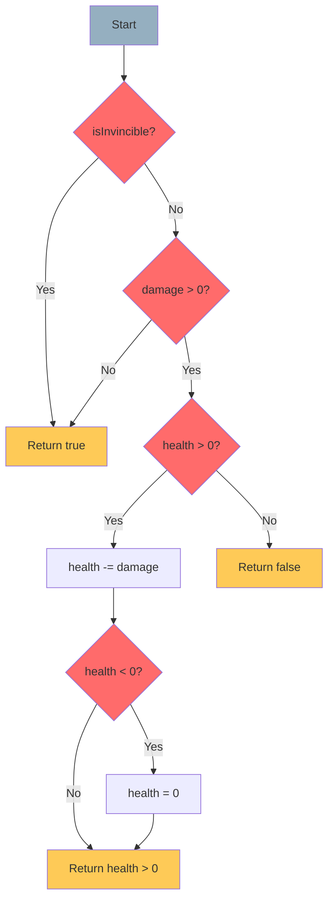
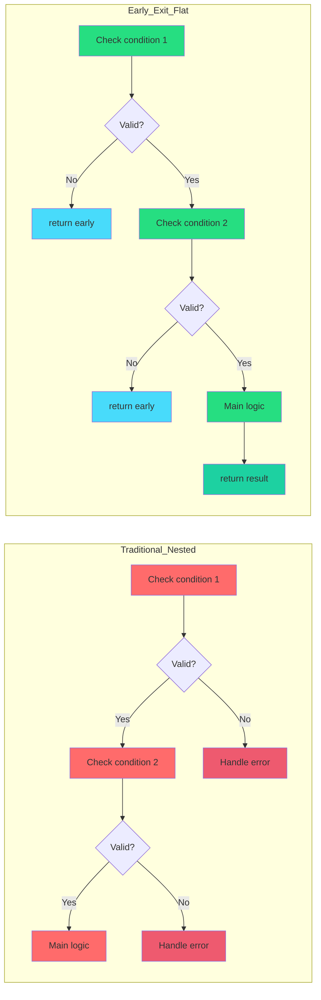
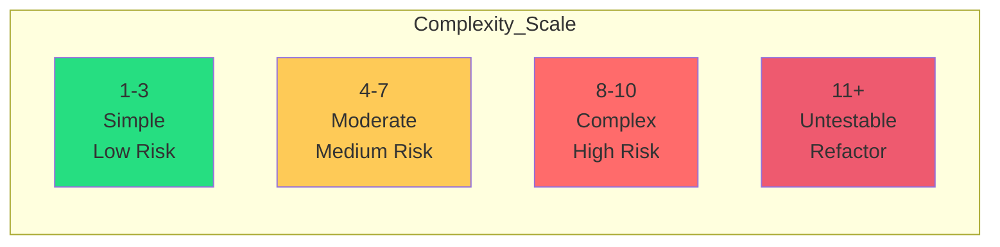
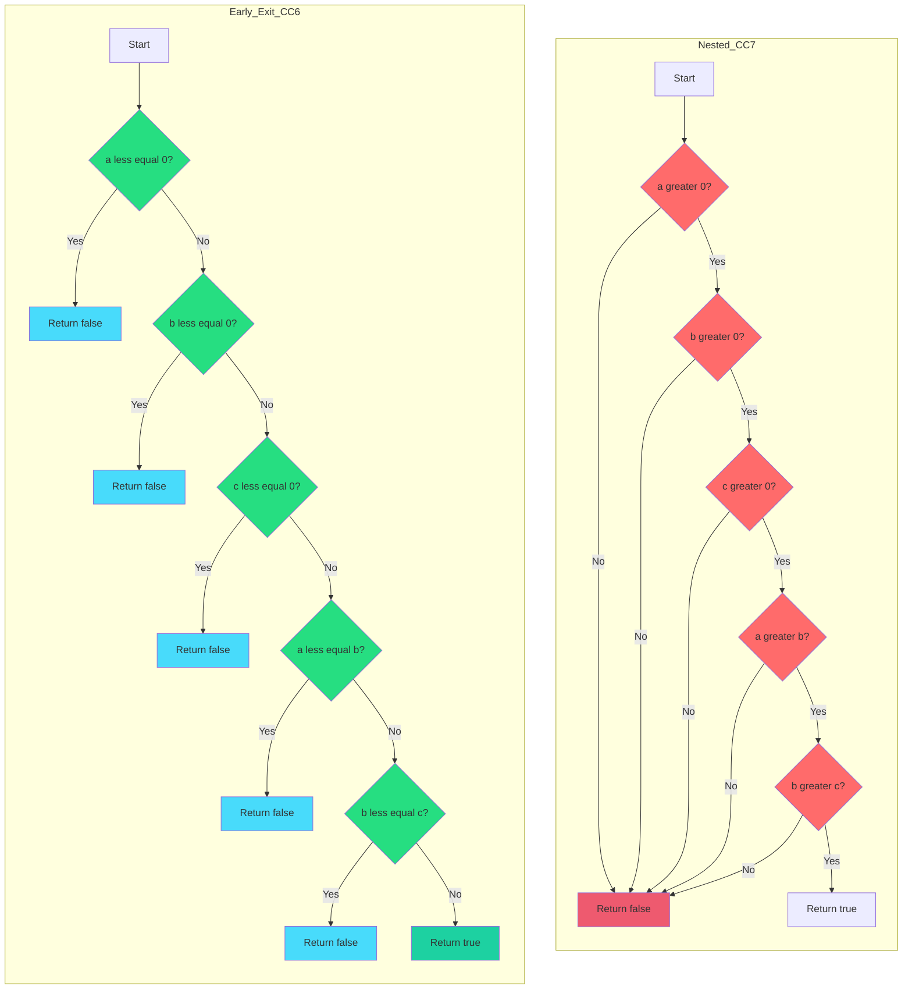
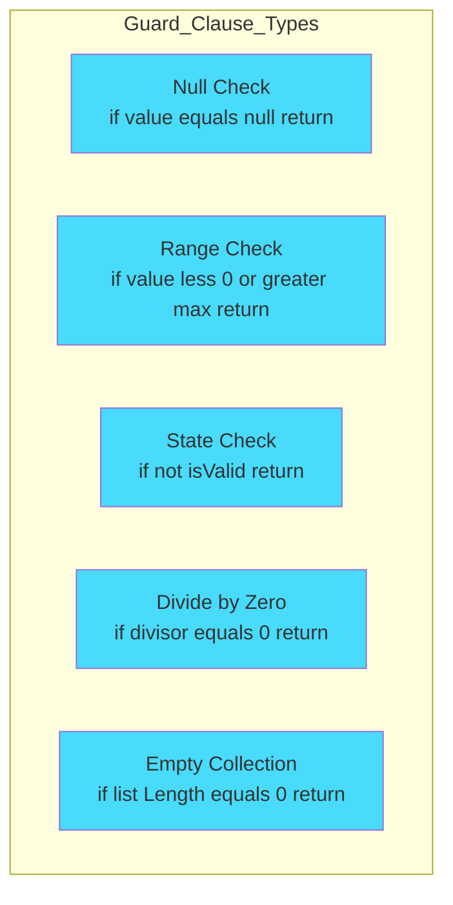
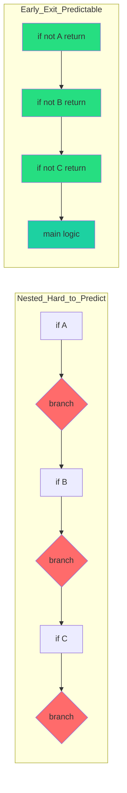
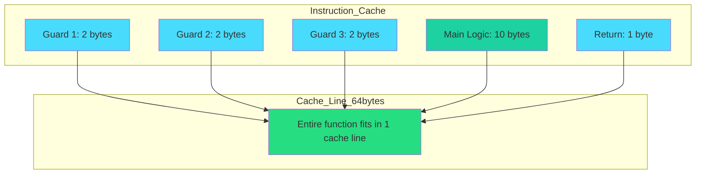
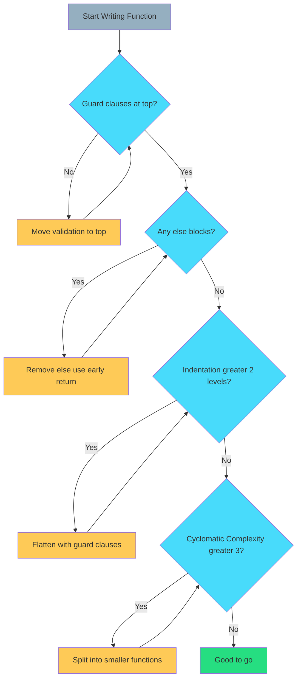

# Chapter 2: Control Flow – The Early Exit Pattern

> **"Flatten your code. Reduce cyclomatic complexity. Validate early, exit fast."**  
> — *The Path to Maintainable Logic*

---

## Table of Contents

1. [The Problem with Nested Logic](#the-problem-with-nested-logic)
2. [What is the Early Exit Pattern?](#what-is-the-early-exit-pattern)
3. [The Rules](#the-rules)
4. [Cyclomatic Complexity Explained](#cyclomatic-complexity-explained)
5. [Real-World Examples](#real-world-examples)
6. [Guard Clauses in Action](#guard-clauses-in-action)
7. [Performance Benefits](#performance-benefits)
8. [Common Mistakes](#common-mistakes)
9. [When to Break the Rules](#when-to-break-the-rules)

---

## The Problem with Nested Logic

Traditional programming encourages nested `if-else` blocks that quickly become unmaintainable:

```csharp
// ❌ NESTED NIGHTMARE
public static bool ProcessDamage(int health, int maxHealth, int damage, bool isInvincible)
{
    if (!isInvincible)
    {
        if (damage > 0)
        {
            if (health > 0)
            {
                health -= damage;
                if (health < 0)
                {
                    health = 0;
                }
                return health > 0;
            }
            else
            {
                return false;
            }
        }
        else
        {
            return true;
        }
    }
    else
    {
        return true;
    }
}
```

### Why This Fails



**Problems:**
- **Cyclomatic Complexity: 7** (max recommended: 3)
- **Indentation: 5 levels** (max recommended: 2)
- **Else blocks everywhere** (banned in DOD)
- **Hard to test** (2^7 = 128 possible paths)
- **Impossible to read** after 6 months

---

## What is the Early Exit Pattern?

The **Early Exit Pattern** validates inputs at the top of a function and returns immediately on failure.

### The Mental Shift



---

## The Rules

### Rule 1: No `else` Blocks (MANDATORY)

```csharp
// ❌ WRONG - else block
if (condition)
{
    return true;
}
else
{
    return false;
}

// ✅ CORRECT - early return
if (condition)
{
    return true;
}
return false;
```

### Rule 2: Validate at the Top

```csharp
// ❌ WRONG - validation scattered
public static void Process(ref int value)
{
    value *= 2;
    if (value < 0) return; // Too late!
}

// ✅ CORRECT - validate first
public static void Process(ref int value)
{
    if (value < 0) return; // Guard clause
    
    value *= 2; // Main logic
}
```

### Rule 3: Maximum 2 Levels of Indentation

```csharp
// ❌ WRONG - 4 levels
public static bool Process(int a, int b)
{
    if (a > 0)
    {
        if (b > 0)
        {
            if (a > b)
            {
                if (a % 2 == 0)
                {
                    return true; // 4 levels deep!
                }
            }
        }
    }
    return false;
}

// ✅ CORRECT - flat structure
public static bool Process(int a, int b)
{
    if (a <= 0) return false;
    if (b <= 0) return false;
    if (a <= b) return false;
    if (a % 2 != 0) return false;
    
    return true; // Success path
}
```

### Rule 4: One Return Type Per Function

```csharp
// ❌ WRONG - unclear return meaning
public static int GetValue()
{
    if (invalid) return -1; // Error sentinel?
    return 42; // Actual value?
}

// ✅ CORRECT - use bool + out
public static bool TryGetValue(out int value)
{
    if (invalid)
    {
        value = default;
        return false; // Clear failure
    }
    
    value = 42;
    return true; // Clear success
}
```

---

## Cyclomatic Complexity Explained

**Cyclomatic Complexity** measures the number of linearly independent paths through code.

### Formula
```
CC = E - N + 2P
Where:
  E = edges in control flow graph
  N = nodes
  P = connected components (usually 1)
```

**Simpler formula:**
```
CC = 1 + (number of decision points)
Decision points = if, for, while, case, &&, ||, ?:
```

### Complexity Ratings



### Example Analysis

```csharp
// ❌ BAD: Cyclomatic Complexity = 7
public static bool Validate(int a, int b, int c)
{
    if (a > 0)              // +1
    {
        if (b > 0)          // +1
        {
            if (c > 0)      // +1
            {
                if (a > b && b > c)  // +2 (&& is a decision)
                {
                    return true;
                }
            }
        }
    }
    return false;
}
// Total: 1 (base) + 6 = 7

// ✅ GOOD: Cyclomatic Complexity = 5
public static bool Validate(int a, int b, int c)
{
    if (a <= 0) return false;      // +1
    if (b <= 0) return false;      // +1
    if (c <= 0) return false;      // +1
    if (a <= b) return false;      // +1
    if (b <= c) return false;      // +1
    
    return true;
}
// Total: 1 (base) + 5 = 6
// Still better readability despite same CC
```

### Visual Comparison



**Notice:** Early exit creates a **linear flow** (top to bottom), while nesting creates a **tree** (exponential paths).

---

## Real-World Examples

### Example 1: Damage Processing

#### ❌ Before (Nested)

```csharp
public static bool TryApplyDamage(ref int current, int damage, bool isInvincible)
{
    if (!isInvincible)
    {
        if (damage > 0)
        {
            if (current > 0)
            {
                current -= damage;
                if (current < 0)
                {
                    current = 0;
                }
                return current > 0;
            }
        }
    }
    return true;
}
```

**Cyclomatic Complexity: 5**  
**Indentation: 4 levels**

---

#### ✅ After (Early Exit)

```csharp
[MethodImpl(MethodImplOptions.AggressiveInlining)]
public static bool TryApplyDamage(ref int current, int damage, bool isInvincible)
{
    // Guard clauses
    if (isInvincible) return true;
    if (damage <= 0) return true;
    if (current <= 0) return false;
    
    // Main logic
    current -= damage;
    if (current < 0) current = 0;
    
    return current > 0;
}
```

**Cyclomatic Complexity: 4**  
**Indentation: 1 level**  
**Lines saved: 6**

---

### Example 2: Cooldown Reset

#### ❌ Before

```csharp
public static void Reset(ref float current, float max, bool canReset)
{
    if (canReset)
    {
        if (max > 0)
        {
            if (current != max)
            {
                current = max;
            }
        }
    }
}
```

---

#### ✅ After

```csharp
[MethodImpl(MethodImplOptions.AggressiveInlining)]
public static void Reset(ref float current, float max, bool canReset)
{
    if (!canReset) return;
    if (max <= 0) return;
    if (current == max) return;
    
    current = max;
}
```

---

### Example 3: Inventory Add

#### ❌ Before

```csharp
public static bool TryAdd(ref int count, int max, int amount)
{
    bool success = false;
    if (amount > 0)
    {
        if (count < max)
        {
            int newCount = count + amount;
            if (newCount <= max)
            {
                count = newCount;
                success = true;
            }
            else
            {
                count = max;
                success = false; // Partial add
            }
        }
    }
    return success;
}
```

---

#### ✅ After

```csharp
[MethodImpl(MethodImplOptions.AggressiveInlining)]
public static bool TryAdd(ref int count, int max, int amount)
{
    if (amount <= 0) return false;
    if (count >= max) return false;
    
    int newCount = count + amount;
    if (newCount > max)
    {
        count = max;
        return false; // Partial add (hit cap)
    }
    
    count = newCount;
    return true;
}
```

---

## Guard Clauses in Action

**Guard Clauses** are the building blocks of the Early Exit Pattern.

### Anatomy of a Guard Clause

```csharp
if (invalidCondition) return defaultValue;
// ^^^                 ^^^^^^
// Check               Exit immediately
```

### Common Patterns



### Template

```csharp
[MethodImpl(MethodImplOptions.AggressiveInlining)]
public static bool TryProcess(ref int value, int min, int max)
{
    // === VALIDATION SECTION ===
    // Guard clauses go here (top of function)
    if (value < min) return false;
    if (value > max) return false;
    if (min >= max) return false;
    
    // === MAIN LOGIC ===
    // Happy path logic (no nesting)
    value = (value - min) * 2 + min;
    
    return true;
}
```

---

## Performance Benefits

### Branch Prediction

Modern CPUs predict branch outcomes. Early exits help the predictor.



**Why?**
- Early exits fail fast → CPU learns "usually continues"
- Nested logic has unpredictable interleaved branches

### Burst Compiler Optimization

Burst can better optimize linear code:

```csharp
// ✅ BURST-FRIENDLY
[MethodImpl(MethodImplOptions.AggressiveInlining)]
public static void Tick(ref float current, float delta)
{
    if (current <= 0) return; // Burst: branch hint
    
    current -= delta; // Burst: vectorize this
    if (current < 0) current = 0; // Burst: cmov instruction
}
```

**Generated Assembly (simplified):**
```asm
; Check if current <= 0
vcomiss xmm0, xmm1
jbe     exit        ; Jump if below/equal (early exit)

; Main logic (vectorized)
vsubss  xmm0, xmm0, xmm2  ; current -= delta
vxorps  xmm1, xmm1, xmm1  ; zero register
vmaxss  xmm0, xmm0, xmm1  ; clamp to zero (no branch!)

exit:
ret
```

### Cache Performance



**Benefit:** Linear code = fewer instruction cache misses.

---

## Common Mistakes

### Mistake 1: Hidden Else Blocks

```csharp
// ❌ WRONG - implicit else
if (condition)
{
    value = 1;
}
value = 2; // This is an "else" in disguise!
```

**Fix:**
```csharp
// ✅ CORRECT - explicit early return
if (condition)
{
    value = 1;
    return;
}
value = 2;
```

---

### Mistake 2: Boolean Flags

```csharp
// ❌ WRONG - flag-driven logic
bool isValid = true;
if (a < 0) isValid = false;
if (b < 0) isValid = false;
if (isValid)
{
    // Main logic
}
```

**Fix:**
```csharp
// ✅ CORRECT - immediate return
if (a < 0) return false;
if (b < 0) return false;

// Main logic
return true;
```

---

### Mistake 3: Unnecessary Nesting for Positive Checks

```csharp
// ❌ WRONG - nesting for positive case
if (isEnabled)
{
    // 50 lines of logic
}

// ✅ CORRECT - invert and exit
if (!isEnabled) return;

// 50 lines of logic (no indentation!)
```

---

### Mistake 4: Multiple Returns in Complex Logic

```csharp
// ⚠️ ACCEPTABLE BUT FRAGILE
public static int Calculate(int a, int b)
{
    if (a < 0) return -1;
    if (b < 0) return -2;
    if (a == 0) return 0;
    if (b == 0) return 0;
    return a / b;
}

// ✅ BETTER - consistent return pattern
public static bool TryCalculate(int a, int b, out int result)
{
    result = default;
    
    if (a < 0) return false;
    if (b < 0) return false;
    if (b == 0) return false; // Prevent div by zero
    
    result = a / b;
    return true;
}
```

---

## When to Break the Rules

### Exception 1: Performance-Critical Positive Checks

```csharp
// ✅ ACCEPTABLE - hot path optimization
public static void ProcessHotPath(ref int value, bool fastMode)
{
    if (fastMode) // 95% of calls
    {
        value *= 2; // Inlined fast path
        return;
    }
    
    // Rare slow path
    value = ComplexCalculation(value);
}
```

**Reason:** CPU branch predictor will strongly prefer the fast path.

---

### Exception 2: Single-Statement Ternary

```csharp
// ✅ ACCEPTABLE - cleaner than if-else
return value > 0 ? value : 0;

// vs verbose alternative
if (value <= 0) return 0;
return value;
```

---

### Exception 3: Switch Statements (State Machines)

```csharp
// ✅ ACCEPTABLE - state machines need switches
switch (state)
{
    case State.Idle:
        ProcessIdle();
        return;
    case State.Running:
        ProcessRunning();
        return;
    default:
        return;
}
```

---

## Summary

### The Early Exit Checklist


    style Q3 fill:#48dbfb
    style Q4 fill:#48dbfb
```

### Key Principles

| Principle | Rule |
|-----------|------|
| **No else blocks** | Use early returns instead |
| **Guard clauses first** | Validate at the top |
| **Max 2 levels** | Flatten deeply nested code |
| **Linear flow** | Top to bottom, no jumping |
| **One concern per check** | Each guard clause tests one thing |
| **Fail fast** | Return immediately on invalid input |

### Before/After Template

```csharp
// ❌ BEFORE
public static bool Process(int a, int b, int c)
{
    if (a > 0)
    {
        if (b > 0)
        {
            if (c > 0)
            {
                return Calculate(a, b, c);
            }
            else
            {
                return false;
            }
        }
        else
        {
            return false;
        }
    }
    else
    {
        return false;
    }
}

// ✅ AFTER
[MethodImpl(MethodImplOptions.AggressiveInlining)]
public static bool TryProcess(int a, int b, int c, out int result)
{
    result = default;
    
    // Guard clauses
    if (a <= 0) return false;
    if (b <= 0) return false;
    if (c <= 0) return false;
    
    // Main logic
    result = Calculate(a, b, c);
    return true;
}
```

---

**Previous:** [← Chapter 1: The Golden Rule](./01-the-golden-rule.md)  
**Next:** [Chapter 3: Return Values - The TryX Pattern →](./03-tryx-pattern.md)

---

## Quick Reference Card

```csharp
// THE EARLY EXIT PATTERN

// 1. Guard clauses at the top
if (invalid1) return defaultValue;
if (invalid2) return defaultValue;
if (invalid3) return defaultValue;

// 2. Main logic (no nesting)
ProcessData();

// 3. Return success
return successValue;

// ===========================
// BANNED PATTERNS
// ===========================

// ❌ NO else blocks
if (condition) { } else { }

// ❌ NO nested if statements (>2 levels)
if (a) { if (b) { if (c) { } } }

// ❌ NO boolean flags for control flow
bool flag = true;
if (x) flag = false;
if (flag) { }
```

---

*Master the Early Exit Pattern, and your code becomes self-documenting, testable, and Burst-friendly.*
