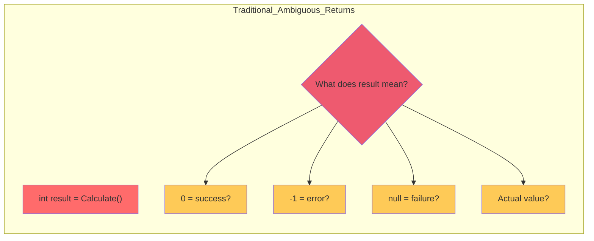
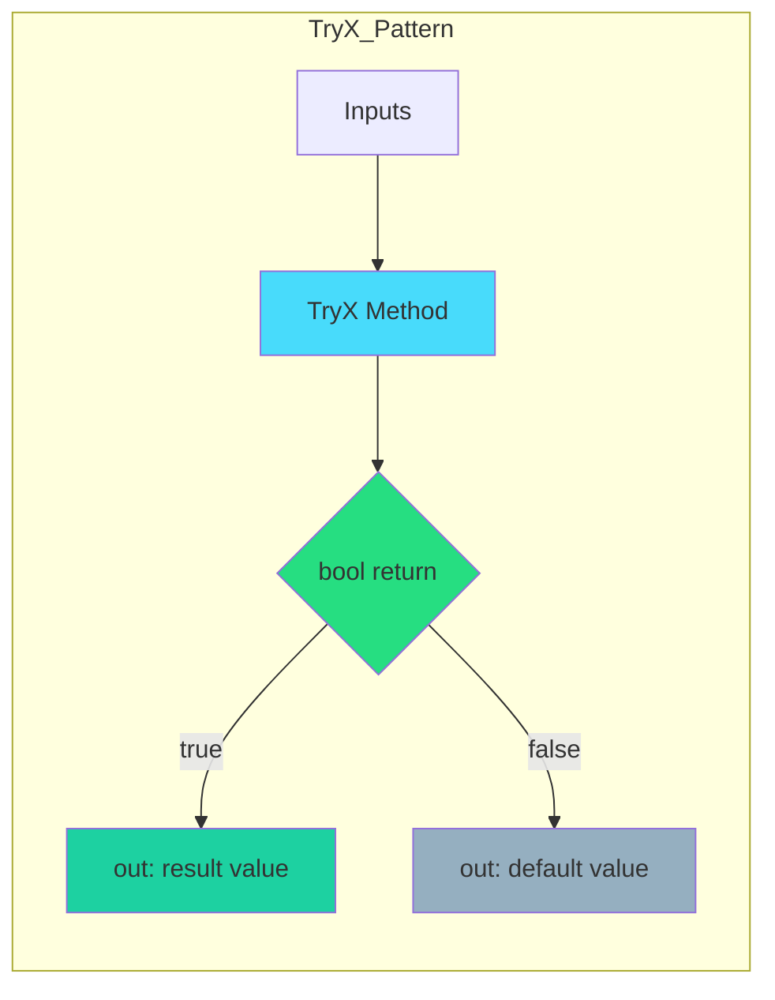
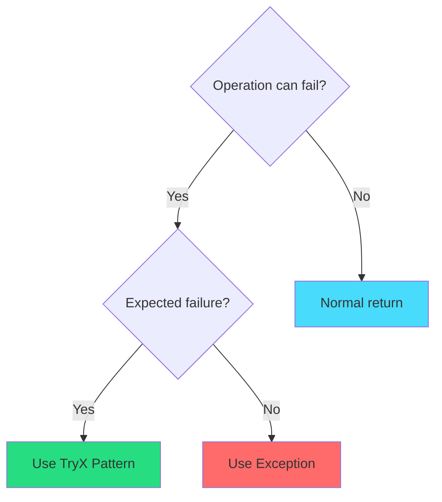
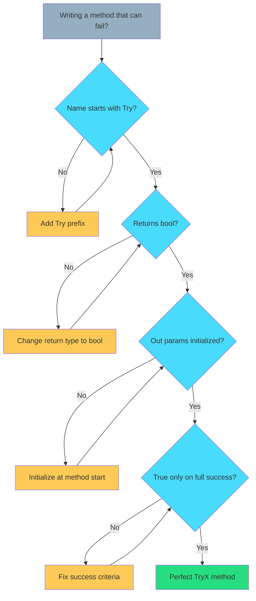

# Chapter 3: Return Values – The TryX Pattern

> **"Make success and failure explicit. Avoid sentinel values. Use bool + out parameters."**  
> — *The Standard for Safe, Predictable APIs*

---

## Table of Contents

1. [The Problem with Traditional Return Values](#the-problem-with-traditional-return-values)
2. [What is the TryX Pattern?](#what-is-the-tryx-pattern)
3. [The Rules](#the-rules)
4. [Anatomy of a TryX Method](#anatomy-of-a-tryx-method)
5. [Real-World Examples](#real-world-examples)
6. [Multiple Return Values](#multiple-return-values)
7. [TryX vs Exceptions](#tryx-vs-exceptions)
8. [Common Mistakes](#common-mistakes)
9. [Performance Benefits](#performance-benefits)

---

## The Problem with Traditional Return Values

Traditional C# code uses inconsistent patterns for success/failure:

### Anti-Pattern 1: Sentinel Values

```csharp
// ❌ BAD - What does -1 mean?
public static int FindIndex(int[] array, int value)
{
    for (int i = 0; i < array.Length; i++)
    {
        if (array[i] == value) return i;
    }
    return -1; // Error? Or valid index?
}

// Usage is error-prone
int index = FindIndex(myArray, 42);
if (index == -1) // Magic number comparison
{
    // Handle error
}
```

**Problems:**
- Magic numbers (-1, 0, null)
- Ambiguous meaning (is -1 an error or valid?)
- Easy to forget to check
- Not Burst-compatible (managed types)

---

### Anti-Pattern 2: Null Returns

```csharp
// ❌ BAD - Null reference exceptions waiting to happen
public static Player FindPlayer(int id)
{
    // Search logic
    return null; // Failure case
}

// Usage creates NRE risk
Player player = FindPlayer(123);
player.TakeDamage(10); // NullReferenceException!
```

---

### Anti-Pattern 3: Exceptions for Control Flow

```csharp
// ❌ BAD - Exceptions are expensive
public static int Parse(string input)
{
    if (!IsValid(input))
    {
        throw new ArgumentException("Invalid input");
    }
    return Convert(input);
}

// Usage requires try-catch
try
{
    int value = Parse(userInput);
}
catch (ArgumentException)
{
    // Handle error - SLOW!
}
```

**Performance Cost:**
- Exception throw: ~1000+ CPU cycles
- Stack unwinding: allocates memory
- Not Burst-compatible

---

### The Clarity Problem



---

## What is the TryX Pattern?

The **TryX Pattern** uses a boolean return value for success/failure, and `out` parameters for actual results.

### The Contract



### Basic Template

```csharp
public static bool TryMethodName(
    /* input parameters */,
    out ResultType result)
{
    result = default; // Always initialize out params
    
    // Validation (early exit)
    if (invalid) return false;
    
    // Main logic
    result = CalculateResult();
    return true;
}
```

---

## The Rules

### Rule 1: Always Return `bool`

```csharp
// ✅ CORRECT - bool indicates success
public static bool TryParse(string input, out int result)
{
    result = default;
    
    if (string.IsNullOrEmpty(input)) return false;
    
    result = int.Parse(input);
    return true;
}
```

### Rule 2: Always Initialize `out` Parameters

```csharp
// ❌ WRONG - out param not initialized on all paths
public static bool TryGetValue(int key, out int value)
{
    if (key < 0) return false; // ERROR: value not set!
    
    value = GetFromCache(key);
    return true;
}

// ✅ CORRECT - initialized immediately
public static bool TryGetValue(int key, out int value)
{
    value = default; // Set first!
    
    if (key < 0) return false;
    
    value = GetFromCache(key);
    return true;
}
```

### Rule 3: Return `true` Only on Success

```csharp
// ❌ WRONG - returns true even on partial success
public static bool TryAdd(ref int count, int max, int amount)
{
    if (count >= max) return true; // Wrong!
    
    count = Math.Min(count + amount, max);
    return true; // Always true?
}

// ✅ CORRECT - true only if fully successful
public static bool TryAdd(ref int count, int max, int amount, out int added)
{
    added = 0;
    
    if (amount <= 0) return false;
    if (count >= max) return false;
    
    int space = max - count;
    added = Math.Min(amount, space);
    count += added;
    
    return added == amount; // Success = added all requested
}
```

### Rule 4: Name Methods with "Try" Prefix

```csharp
// ❌ WRONG - unclear that it can fail
public static bool Parse(string input, out int result) { }

// ✅ CORRECT - "Try" signals potential failure
public static bool TryParse(string input, out int result) { }
```

---

## Anatomy of a TryX Method

```csharp
[MethodImpl(MethodImplOptions.AggressiveInlining)]
public static bool TryCalculate(
    // === INPUT PARAMETERS ===
    float a,
    float b,
    float c,
    
    // === OUTPUT PARAMETERS ===
    out float result)
{
    // === STEP 1: Initialize out params ===
    result = default;
    
    // === STEP 2: Early exit validation ===
    if (a <= 0) return false;
    if (b <= 0) return false;
    if (c <= 0) return false;
    
    // === STEP 3: Main logic ===
    result = (a + b) * c;
    
    // === STEP 4: Return success ===
    return true;
}
```

### Usage Pattern

```csharp
// Clean, explicit usage
if (TryCalculate(x, y, z, out float result))
{
    // Success path - result is valid
    Debug.Log($"Result: {result}");
}
else
{
    // Failure path - result is default(float) = 0
    Debug.Log("Calculation failed");
}
```

---

## Real-World Examples

### Example 1: Safe Division

```csharp
[MethodImpl(MethodImplOptions.AggressiveInlining)]
public static bool TryDivide(float numerator, float denominator, out float result)
{
    result = 0f;
    
    if (denominator == 0f) return false;
    if (float.IsNaN(numerator)) return false;
    if (float.IsNaN(denominator)) return false;
    
    result = numerator / denominator;
    
    if (float.IsNaN(result)) return false;
    if (float.IsInfinity(result)) return false;
    
    return true;
}

// Usage
if (TryDivide(a, b, out float quotient))
{
    velocity *= quotient;
}
```

---

### Example 2: Inventory Operations

```csharp
[MethodImpl(MethodImplOptions.AggressiveInlining)]
public static bool TryAddItem(ref int count, int max, int amount, out int added)
{
    added = 0;
    
    // Validation
    if (amount <= 0) return false;
    if (count >= max) return false;
    if (max <= 0) return false;
    
    // Calculate how much can actually be added
    int available = max - count;
    added = Math.Min(amount, available);
    count += added;
    
    // Success only if we added everything requested
    return added == amount;
}

// Usage
if (TryAddItem(ref inventory.Count, inventory.Max, 5, out int actuallyAdded))
{
    Debug.Log($"Added all 5 items");
}
else
{
    Debug.Log($"Only added {actuallyAdded} items");
}
```

---

### Example 3: Bounds Checking

```csharp
[MethodImpl(MethodImplOptions.AggressiveInlining)]
public static bool TryGetInBounds(
    NativeArray<float> array,
    int index,
    out float value)
{
    value = default;
    
    if (!array.IsCreated) return false;
    if (index < 0) return false;
    if (index >= array.Length) return false;
    
    value = array[index];
    return true;
}

// Usage in Job
public void Execute(int index)
{
    if (TryGetInBounds(myArray, index, out float value))
    {
        // Safe to use value
        result[index] = value * 2f;
    }
}
```

---

### Example 4: State Machine Transitions

```csharp
[MethodImpl(MethodImplOptions.AggressiveInlining)]
public static bool TryTransition(
    State currentState,
    State targetState,
    out State newState)
{
    newState = currentState; // Default to current
    
    // Validation
    if (currentState == targetState) return false;
    if (!IsValidTransition(currentState, targetState)) return false;
    
    // Perform transition
    newState = targetState;
    return true;
}
```

---

## Multiple Return Values

### Pattern 1: Multiple Out Parameters

```csharp
[MethodImpl(MethodImplOptions.AggressiveInlining)]
public static bool TryParse2D(
    string input,
    out float x,
    out float y)
{
    x = 0f;
    y = 0f;
    
    if (string.IsNullOrEmpty(input)) return false;
    
    string[] parts = input.Split(',');
    if (parts.Length != 2) return false;
    
    if (!float.TryParse(parts[0], out x)) return false;
    if (!float.TryParse(parts[1], out y)) return false;
    
    return true;
}

// Usage
if (TryParse2D("3.5,7.2", out float x, out float y))
{
    position = new Vector2(x, y);
}
```

---

### Pattern 2: Struct Output

```csharp
// When you need many return values, use a struct
public struct CalculationResult
{
    public float Sum;
    public float Product;
    public float Average;
}

[MethodImpl(MethodImplOptions.AggressiveInlining)]
public static bool TryCalculateStats(
    NativeArray<float> values,
    out CalculationResult result)
{
    result = default;
    
    if (!values.IsCreated) return false;
    if (values.Length == 0) return false;
    
    float sum = 0f;
    float product = 1f;
    
    for (int i = 0; i < values.Length; i++)
    {
        sum += values[i];
        product *= values[i];
    }
    
    result = new CalculationResult
    {
        Sum = sum,
        Product = product,
        Average = sum / values.Length
    };
    
    return true;
}
```

---

## TryX vs Exceptions

### When to Use TryX



### Performance Comparison

| Pattern | Success Cost | Failure Cost | Burst Compatible |
|---------|-------------|--------------|------------------|
| **TryX** | ~5 cycles | ~5 cycles | ✅ Yes |
| **Exception** | ~5 cycles | ~1000+ cycles | ❌ No |
| **Sentinel** | ~5 cycles | ~5 cycles | ⚠️ Ambiguous |

### Example: Parsing

```csharp
// ❌ EXCEPTION - expensive on failure
public static int Parse(string input)
{
    if (!IsValid(input))
        throw new FormatException(); // 1000+ cycles
    return Convert(input);
}

// ✅ TRYX - fast on failure
public static bool TryParse(string input, out int result)
{
    result = 0;
    if (!IsValid(input)) return false; // 5 cycles
    result = Convert(input);
    return true;
}
```

### When Exceptions Are Better

```csharp
// ✅ EXCEPTION - programmer error, should never happen
public static float GetElement(float[] array, int index)
{
    if (array == null)
        throw new ArgumentNullException(nameof(array));
    
    if (index < 0 || index >= array.Length)
        throw new ArgumentOutOfRangeException(nameof(index));
    
    return array[index];
}

// This is a programming mistake, not expected failure
```

---

## Common Mistakes

### Mistake 1: Not Initializing Out Parameters

```csharp
// ❌ WRONG
public static bool TryGetValue(int key, out int value)
{
    if (cache.TryGetValue(key, out value)) // Compiler error!
    {
        return true;
    }
    return false; // value not assigned on this path
}

// ✅ CORRECT
public static bool TryGetValue(int key, out int value)
{
    value = default; // Initialize first
    
    if (cache.TryGetValue(key, out value))
    {
        return true;
    }
    return false;
}
```

---

### Mistake 2: Returning True on Partial Success

```csharp
// ❌ WRONG - ambiguous success
public static bool TryRead(Stream stream, byte[] buffer, out int bytesRead)
{
    bytesRead = stream.Read(buffer, 0, buffer.Length);
    return bytesRead > 0; // What if we wanted 100 but got 50?
}

// ✅ CORRECT - explicit success criteria
public static bool TryReadExact(
    Stream stream,
    byte[] buffer,
    int count,
    out int bytesRead)
{
    bytesRead = 0;
    
    if (count <= 0) return false;
    if (buffer.Length < count) return false;
    
    bytesRead = stream.Read(buffer, 0, count);
    return bytesRead == count; // Success = read exactly what we wanted
}
```

---

### Mistake 3: Using Out for Input

```csharp
// ❌ WRONG - out param used for input
public static bool TryModify(out int value)
{
    value = value * 2; // Can't read out param before assignment!
    return true;
}

// ✅ CORRECT - use ref for input/output
public static bool TryModify(ref int value)
{
    if (value <= 0) return false;
    value *= 2;
    return true;
}
```

---

### Mistake 4: Swallowing Important Errors

```csharp
// ❌ WRONG - loses error information
public static bool TryParse(string json, out MyData data)
{
    data = default;
    
    try
    {
        data = JsonUtility.FromJson<MyData>(json);
        return true;
    }
    catch
    {
        return false; // What went wrong?
    }
}

// ✅ BETTER - log or expose error details
public static bool TryParse(
    string json,
    out MyData data,
    out string errorMessage)
{
    data = default;
    errorMessage = null;
    
    try
    {
        data = JsonUtility.FromJson<MyData>(json);
        return true;
    }
    catch (Exception ex)
    {
        errorMessage = ex.Message;
        return false;
    }
}
```

---

## Performance Benefits

### Memory Allocation Comparison

```csharp
// ❌ EXCEPTION PATH - allocates memory
try
{
    int value = Parse(input); // May throw
}
catch (Exception ex) // Allocates exception object
{
    // Stack trace allocation
}

// ✅ TRYX PATH - zero allocations
if (TryParse(input, out int value))
{
    // Success - no allocations
}
else
{
    // Failure - no allocations
}
```

### Burst Compilation

```csharp
[BurstCompile]
public struct ParseJob : IJobParallelFor
{
    [ReadOnly] public NativeArray<float> Input;
    public NativeArray<int> Output;
    
    public void Execute(int index)
    {
        // ✅ TryX works in Burst
        if (TryConvert(Input[index], out int result))
        {
            Output[index] = result;
        }
        else
        {
            Output[index] = -1;
        }
    }
    
    [MethodImpl(MethodImplOptions.AggressiveInlining)]
    private static bool TryConvert(float value, out int result)
    {
        result = 0;
        if (value < int.MinValue) return false;
        if (value > int.MaxValue) return false;
        result = (int)value;
        return true;
    }
}
```

---

## Summary

### The TryX Checklist



### Key Principles

| Principle | Rule |
|-----------|------|
| **Return bool** | `true` = success, `false` = failure |
| **Use out params** | For actual result values |
| **Initialize immediately** | `result = default;` at method start |
| **Name with Try** | `TryParse`, `TryGet`, `TryCalculate` |
| **Early exit on validation** | Fail fast with `return false` |
| **True only on success** | Partial success should return `false` |

### Template

```csharp
[MethodImpl(MethodImplOptions.AggressiveInlining)]
public static bool TryMethodName(
    /* inputs */,
    out ResultType result)
{
    // 1. Initialize out params
    result = default;
    
    // 2. Validate (early exit)
    if (invalid1) return false;
    if (invalid2) return false;
    
    // 3. Main logic
    result = Calculate();
    
    // 4. Return success
    return true;
}
```

---

**Previous:** [← Chapter 2: Early Exit Pattern](./02-early-exit-pattern.md)  
**Next:** [Chapter 4: Burst Compatibility & Primitive Logic →](./04-burst-compatibility.md)

---

## Quick Reference

```csharp
// THE TRYX PATTERN

// ✅ CORRECT
public static bool TryX(input, out result)
{
    result = default;           // Initialize
    if (invalid) return false;  // Validate
    result = Calculate();       // Logic
    return true;                // Success
}

// ❌ WRONG PATTERNS
int result = Method();          // Sentinel value
Object result = Method();       // Null return
try { Method(); }              // Exception for control flow
```

---

*The TryX Pattern makes your APIs explicit, safe, and Burst-compatible. Use it everywhere.*
