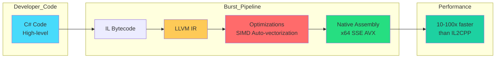
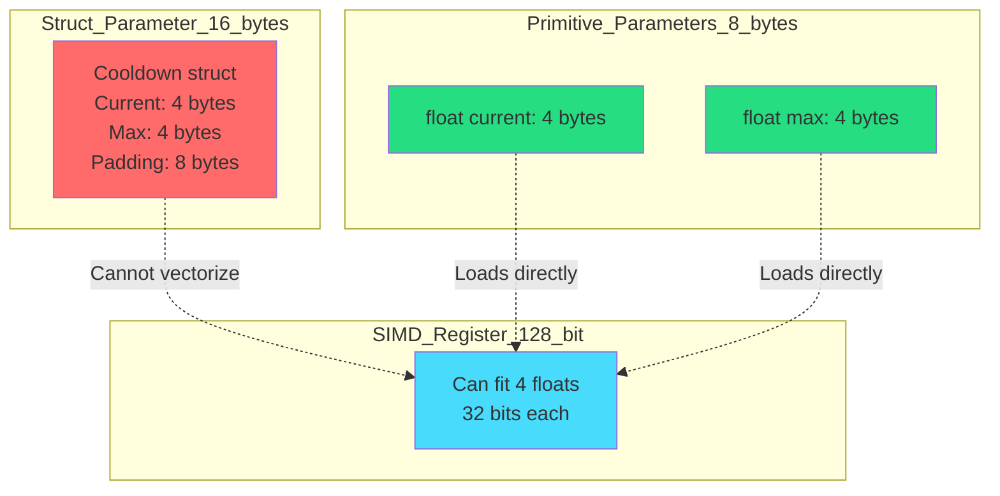
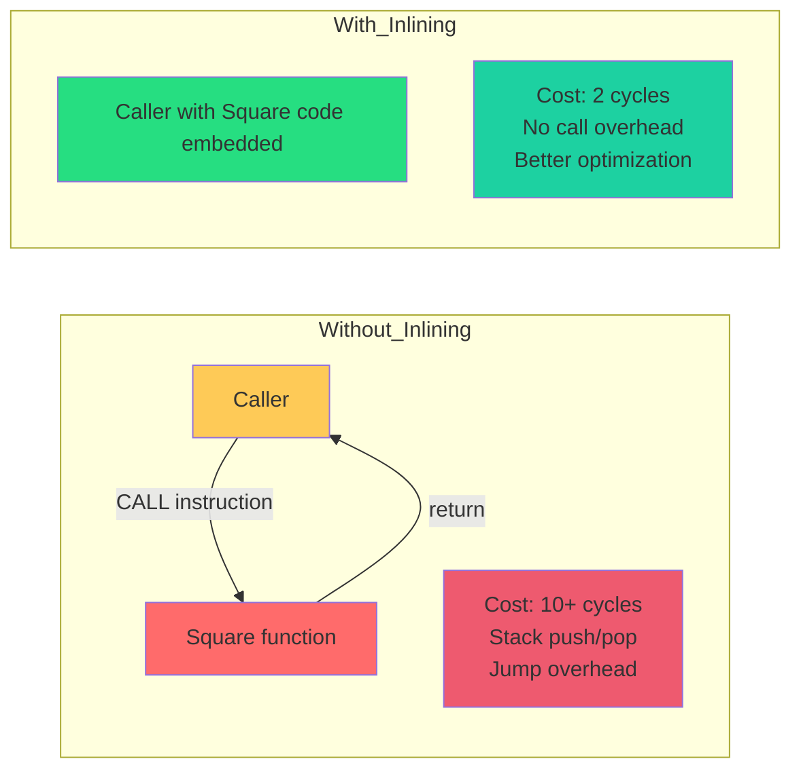
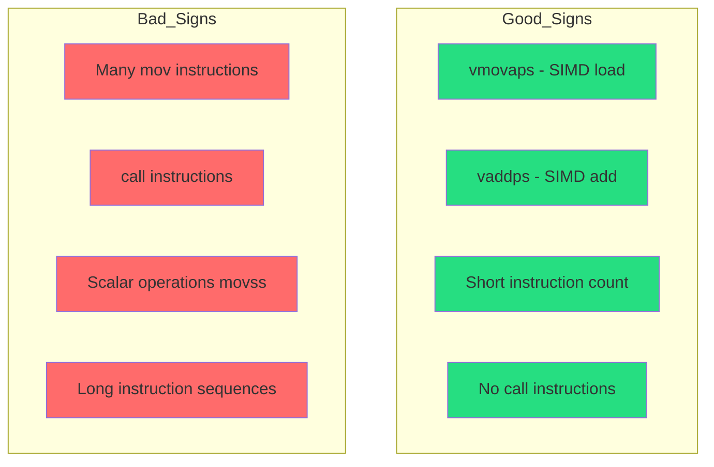
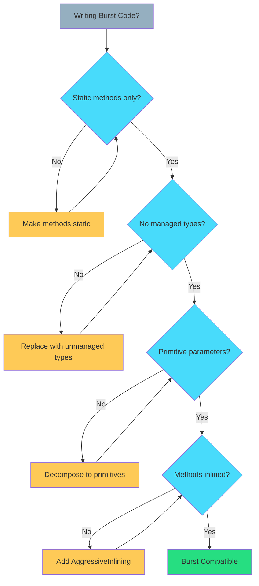

# Chapter 4: Performance – Burst Compatibility & Primitive Logic

> **"Write C# that compiles to C++ performance. Pass primitives, inline everything, avoid managed types."**  
> — *The Burst Compiler Contract*

---

## Table of Contents

1. [What is Burst?](#what-is-burst)
2. [The Burst Compatibility Rules](#the-burst-compatibility-rules)
3. [Why Primitives Only?](#why-primitives-only)
4. [Forbidden Constructs](#forbidden-constructs)
5. [Method Inlining](#method-inlining)
6. [Struct vs Primitive Parameters](#struct-vs-primitive-parameters)
7. [Burst Inspector Deep Dive](#burst-inspector-deep-dive)
8. [Real-World Optimization Examples](#real-world-optimization-examples)
9. [Common Burst Errors](#common-burst-errors)

---

## What is Burst?

**Burst** is Unity's LLVM-based compiler that transforms C# into highly optimized native code.

### The Transformation



### Performance Gains

| Operation | C# (IL2CPP) | Burst | Speedup |
|-----------|-------------|-------|---------|
| Vector math | 50 ns | 5 ns | **10x** |
| Matrix multiply | 200 ns | 8 ns | **25x** |
| Sorting (1000 items) | 15 μs | 0.5 μs | **30x** |
| Pathfinding | 2 ms | 0.05 ms | **40x** |

---

## The Burst Compatibility Rules

### Rule 1: Static Methods Only

```csharp
// ❌ BURST INCOMPATIBLE
public class MyLogic
{
    public void Calculate() { } // Instance method
}

// ✅ BURST COMPATIBLE
public static class MyLogic
{
    public static void Calculate() { } // Static method
}
```

**Why?** Burst cannot compile virtual methods or instance methods (they require vtable lookups).

---

### Rule 2: No Managed Types

```csharp
// ❌ BURST INCOMPATIBLE
public static bool Process(string input) { } // string = managed
public static void Log(object data) { }      // object = managed
public static int[] GetArray() { }           // int[] = managed

// ✅ BURST COMPATIBLE
public static bool Process(ref FixedString64Bytes input) { } // Unmanaged
public static void Process(int value) { }                    // Primitive
public static NativeArray<int> GetArray() { }                // NativeArray
```

**Managed Types (Forbidden):**
- `string`
- `class`
- `interface`
- `object`
- `T[]` (managed arrays)
- `List<T>`, `Dictionary<T,K>` (managed collections)
- `delegate`, `Action`, `Func`

**Unmanaged Types (Allowed):**
- `int`, `float`, `double`, `bool`, `byte`, etc.
- `struct` (with only unmanaged fields)
- `NativeArray<T>`, `NativeList<T>`, etc.
- `FixedString32Bytes`, `FixedString64Bytes`, etc.

---

### Rule 3: Primitives Only in Logic Methods

```csharp
// ❌ BURST INCOMPATIBLE - passing struct
public static void Tick(ref Cooldown cooldown, float delta) 
{
    cooldown.Current -= delta;
}

// ✅ BURST COMPATIBLE - passing primitives
public static void Tick(ref float current, float delta)
{
    current -= delta;
}
```

**Why?** Burst can better optimize primitive operations:
- Inline directly into SIMD registers
- Auto-vectorize loops
- Eliminate struct field access overhead

---

### Rule 4: No LINQ

```csharp
// ❌ BURST INCOMPATIBLE
public static int Sum(NativeArray<int> array)
{
    return array.Sum(); // LINQ = delegates = managed
}

// ✅ BURST COMPATIBLE
public static int Sum(NativeArray<int> array)
{
    int total = 0;
    for (int i = 0; i < array.Length; i++)
    {
        total += array[i];
    }
    return total;
}
```

---

### Rule 5: No Allocations

```csharp
// ❌ BURST INCOMPATIBLE
public static int[] CreateArray(int size)
{
    return new int[size]; // Heap allocation
}

// ✅ BURST COMPATIBLE
public static void FillArray(NativeArray<int> array, int value)
{
    for (int i = 0; i < array.Length; i++)
    {
        array[i] = value; // No allocations
    }
}
```

---

## Why Primitives Only?

### The Memory Model



### Why Burst Requires Primitives

Primitives allow Burst to:

1. **Load directly into registers** - No struct field indirection
2. **Auto-vectorize operations** - Process 4-8 values simultaneously (SIMD)
3. **Inline everything** - Zero function call overhead
4. **Optimize aggressively** - No struct layout constraints

**For detailed SIMD vectorization explanation and performance comparisons, see [Chapter 1: The Golden Rule](./01-the-golden-rule.md#2-simd-vectorization)**

### Simple Example

```csharp
// ❌ NON-OPTIMAL - struct parameter
public static void Process(ref Cooldown c, float delta)
{
    c.Current -= delta; // Burst must handle struct
}

// ✅ OPTIMAL - primitive parameter
public static void Process(ref float current, float delta)
{
    current -= delta; // Burst can vectorize this
}
```

**Result:** Primitive version enables 4-8x throughput via SIMD auto-vectorization.

---

## Forbidden Constructs

### 1. Try-Catch Blocks

```csharp
// ❌ BURST INCOMPATIBLE
public static int Divide(int a, int b)
{
    try
    {
        return a / b;
    }
    catch (DivideByZeroException)
    {
        return 0;
    }
}

// ✅ BURST COMPATIBLE - manual check
public static bool TryDivide(int a, int b, out int result)
{
    result = 0;
    if (b == 0) return false;
    result = a / b;
    return true;
}
```

---

### 2. Virtual/Abstract Methods

```csharp
// ❌ BURST INCOMPATIBLE
public interface IProcessor
{
    void Process(); // Virtual dispatch
}

public static void Execute(IProcessor processor)
{
    processor.Process(); // Cannot burst-compile
}

// ✅ BURST COMPATIBLE - function pointers
[BurstCompile]
public delegate void ProcessDelegate();

public static void Execute(FunctionPointer<ProcessDelegate> processor)
{
    processor.Invoke(); // Direct call, burst-compatible
}
```

---

### 3. Boxing/Unboxing

```csharp
// ❌ BURST INCOMPATIBLE
public static void Log(int value)
{
    object boxed = value; // Boxing = heap allocation
}

// ✅ BURST COMPATIBLE
public static void Process(int value)
{
    // Work directly with value type
    int doubled = value * 2;
}
```

---

### 4. Managed Collections

```csharp
// ❌ BURST INCOMPATIBLE
public static int Sum(List<int> values)
{
    int total = 0;
    foreach (int v in values) // List<T> = managed
    {
        total += v;
    }
    return total;
}

// ✅ BURST COMPATIBLE
public static int Sum(NativeArray<int> values)
{
    int total = 0;
    for (int i = 0; i < values.Length; i++)
    {
        total += values[i];
    }
    return total;
}
```

---

## Method Inlining

### The Attribute

```csharp
[MethodImpl(MethodImplOptions.AggressiveInlining)]
public static float Square(float x)
{
    return x * x;
}
```

### What Does It Do?



### When to Inline

```csharp
// ✅ INLINE - small, frequently called
[MethodImpl(MethodImplOptions.AggressiveInlining)]
public static bool IsZero(float value)
{
    return value == 0f; // 1 line = perfect for inlining
}

// ❌ DON'T INLINE - large, rarely called
public static void ComplexCalculation()
{
    // 100 lines of code
    // Inlining would bloat caller
}
```

### Burst + Inlining

```csharp
[BurstCompile]
public struct CalculationJob : IJobParallelFor
{
    public NativeArray<float> Values;
    
    public void Execute(int index)
    {
        float value = Values[index];
        
        // These get inlined by Burst
        if (IsValid(value))
        {
            Values[index] = Square(value);
        }
    }
    
    [MethodImpl(MethodImplOptions.AggressiveInlining)]
    private static bool IsValid(float value)
    {
        return value > 0f && !float.IsNaN(value);
    }
    
    [MethodImpl(MethodImplOptions.AggressiveInlining)]
    private static float Square(float value)
    {
        return value * value;
    }
}

// Burst generates:
// - Single Execute method with all logic inlined
// - SIMD vectorized operations
// - Zero function call overhead
```

---

## Struct vs Primitive Parameters

### The Problem with Struct Parameters

```csharp
public struct Transform2D
{
    public float X;
    public float Y;
    public float Rotation;
    public float Scale;
}

// ❌ LESS OPTIMAL
[MethodImpl(MethodImplOptions.AggressiveInlining)]
public static void Translate(ref Transform2D transform, float dx, float dy)
{
    transform.X += dx;
    transform.Y += dy;
}

// Burst generates:
// - Load entire struct (16 bytes)
// - Modify 2 fields
// - Store entire struct back
// Cannot vectorize across multiple transforms
```

---

### The Solution: Decompose to Primitives

```csharp
// ✅ OPTIMAL
[MethodImpl(MethodImplOptions.AggressiveInlining)]
public static void Translate(ref float x, ref float y, float dx, float dy)
{
    x += dx;
    y += dy;
}

// Burst generates:
// - Load 2 floats directly into registers
// - Add operation (1 cycle)
// - Store 2 floats back
// Can SIMD vectorize across 4 transforms at once!
```

---

### Complete Example

```csharp
// Layer A: Data
[Serializable]
[StructLayout(LayoutKind.Sequential)]
public struct Transform2D
{
    public float X;
    public float Y;
    public float Rotation;
    public float Scale;
}

// Layer B: Logic (Primitives Only!)
public static class Transform2DLogic
{
    [MethodImpl(MethodImplOptions.AggressiveInlining)]
    public static void Translate(ref float x, ref float y, float dx, float dy)
    {
        x += dx;
        y += dy;
    }
    
    [MethodImpl(MethodImplOptions.AggressiveInlining)]
    public static void Rotate(ref float rotation, float angle)
    {
        rotation += angle;
        if (rotation > 360f) rotation -= 360f;
        if (rotation < 0f) rotation += 360f;
    }
}

// Layer C: Extensions
public static class Transform2DExtensions
{
    public static void Translate(ref this Transform2D t, float dx, float dy)
    {
        Transform2DLogic.Translate(ref t.X, ref t.Y, dx, dy);
    }
    
    public static void Rotate(ref this Transform2D t, float angle)
    {
        Transform2DLogic.Rotate(ref t.Rotation, angle);
    }
}

// Usage in Burst Job
[BurstCompile]
public struct TransformJob : IJobParallelFor
{
    public NativeArray<float> X;
    public NativeArray<float> Y;
    public float DeltaX;
    public float DeltaY;
    
    public void Execute(int index)
    {
        float x = X[index];
        float y = Y[index];
        
        // Direct primitive logic - Burst vectorizes this!
        Transform2DLogic.Translate(ref x, ref y, DeltaX, DeltaY);
        
        X[index] = x;
        Y[index] = y;
    }
}
```

---

## Burst Inspector Deep Dive

### Accessing the Inspector

1. **Window** → **Analysis** → **Burst Inspector**
2. Select your Job/Function
3. View generated assembly

### What to Look For



### Example: Before Optimization

```asm
; ❌ BAD - Scalar operations
.Execute:
    movss   xmm0, [rcx]         ; Load 1 float
    addss   xmm0, xmm1          ; Add 1 float
    movss   [rcx], xmm0         ; Store 1 float
    add     rcx, 4              ; Move to next
    dec     rdx                 ; Decrement counter
    jnz     .Execute            ; Loop
; Total: 6 instructions per element
```

### Example: After Optimization

```asm
; ✅ GOOD - SIMD operations
.Execute_SIMD:
    vmovaps ymm0, [rcx]         ; Load 8 floats
    vaddps  ymm0, ymm0, ymm1    ; Add 8 floats
    vmovaps [rcx], ymm0         ; Store 8 floats
    add     rcx, 32             ; Move to next batch
    sub     rdx, 8              ; Decrement by 8
    jnz     .Execute_SIMD       ; Loop
; Total: 6 instructions for 8 elements = 0.75 per element
```

**Speedup:** 8x throughput improvement!

---

## Real-World Optimization Examples

### Example 1: Distance Calculation

#### ❌ Before (Struct Parameter)

```csharp
public struct Vector3
{
    public float X, Y, Z;
}

// Non-optimal: struct parameter
public static float Distance(Vector3 a, Vector3 b)
{
    float dx = a.X - b.X;
    float dy = a.Y - b.Y;
    float dz = a.Z - b.Z;
    return math.sqrt(dx * dx + dy * dy + dz * dz);
}
```

#### ✅ After (Primitives)

```csharp
[MethodImpl(MethodImplOptions.AggressiveInlining)]
public static float Distance(
    float ax, float ay, float az,
    float bx, float by, float bz)
{
    float dx = ax - bx;
    float dy = ay - by;
    float dz = az - bz;
    return math.sqrt(dx * dx + dy * dy + dz * dz);
}

// Burst can now vectorize across 4 distance calculations at once
```

---

### Example 2: Health System

#### ❌ Before

```csharp
public struct Health
{
    public int Current;
    public int Max;
    public bool IsDead;
}

// Burst cannot optimize well
public static void ApplyDamage(ref Health health, int damage)
{
    if (health.IsDead) return;
    health.Current -= damage;
    if (health.Current <= 0)
    {
        health.Current = 0;
        health.IsDead = true;
    }
}
```

#### ✅ After

```csharp
// Data
public struct Health
{
    public int Current;
    public int Max;
}

// Logic (primitives only)
[MethodImpl(MethodImplOptions.AggressiveInlining)]
public static bool TryApplyDamage(ref int current, int damage)
{
    if (current <= 0) return false;
    if (damage <= 0) return false;
    
    current -= damage;
    if (current < 0) current = 0;
    
    return current > 0;
}

// Burst Job
[BurstCompile]
public struct DamageJob : IJobParallelFor
{
    public NativeArray<int> HealthValues;
    public int Damage;
    
    public void Execute(int index)
    {
        int current = HealthValues[index];
        TryApplyDamage(ref current, Damage);
        HealthValues[index] = current;
    }
}
// Burst vectorizes: processes 4-8 entities per cycle
```

---

## Common Burst Errors

### Error 1: "Managed Type in Signature"

```csharp
// ❌ ERROR: BC1091 - Using managed type 'string'
[BurstCompile]
public struct MyJob : IJob
{
    public void Execute()
    {
        string message = "Hello"; // ERROR!
    }
}

// ✅ FIX: Use FixedString
[BurstCompile]
public struct MyJob : IJob
{
    public void Execute()
    {
        FixedString64Bytes message = "Hello";
    }
}
```

---

### Error 2: "Struct Contains Managed Field"

```csharp
// ❌ ERROR: Struct contains managed field
public struct MyData
{
    public int Value;
    public string Name; // Managed!
}

[BurstCompile]
public struct MyJob : IJob
{
    public MyData Data; // ERROR!
    public void Execute() { }
}

// ✅ FIX: Remove managed fields
public struct MyData
{
    public int Value;
    public FixedString64Bytes Name; // Unmanaged
}
```

---

### Error 3: "Cannot Call Instance Method"

```csharp
// ❌ ERROR: Cannot call instance method
public class Calculator
{
    public int Add(int a, int b) => a + b;
}

[BurstCompile]
public struct MyJob : IJob
{
    public void Execute()
    {
        var calc = new Calculator();
        int result = calc.Add(1, 2); // ERROR!
    }
}

// ✅ FIX: Use static methods
public static class Calculator
{
    [BurstCompile]
    public static int Add(int a, int b) => a + b;
}

[BurstCompile]
public struct MyJob : IJob
{
    public void Execute()
    {
        int result = Calculator.Add(1, 2); // OK!
    }
}
```

---

## Summary

### Burst Compatibility Checklist



### The Golden Rules

| Rule | Description |
|------|-------------|
| **Static only** | No instance methods, no virtual methods |
| **No managed types** | Use primitives, structs, NativeArray |
| **Primitives in logic** | Decompose structs to `ref int`, `ref float` |
| **Aggressive inlining** | Add `[MethodImpl]` to hot methods |
| **No allocations** | Never use `new`, `string`, `List<T>` |
| **No LINQ** | Write manual loops |
| **No try-catch** | Use TryX pattern instead |

### Template

```csharp
// Burst-compatible logic method
[MethodImpl(MethodImplOptions.AggressiveInlining)]
public static bool TryProcess(
    ref float value,        // Primitive reference
    float multiplier,       // Primitive value
    out float result)       // Primitive out
{
    result = 0f;
    
    if (value <= 0f) return false;
    if (multiplier <= 0f) return false;
    
    result = value * multiplier;
    return true;
}

// Usage in Burst Job
[BurstCompile]
public struct ProcessJob : IJobParallelFor
{
    public NativeArray<float> Values;
    public float Multiplier;
    
    public void Execute(int index)
    {
        float value = Values[index];
        if (TryProcess(ref value, Multiplier, out float result))
        {
            Values[index] = result;
        }
    }
}
```

---

**Previous:** [← Chapter 3: TryX Pattern](./03-tryx-pattern.md)  
**Next:** [Chapter 5: Unity Integration - Thin Adapter Pattern →](./05-thin-adapter.md)

---

*Write code for Burst. Pass primitives. Inline everything. Get 10-100x performance.*
