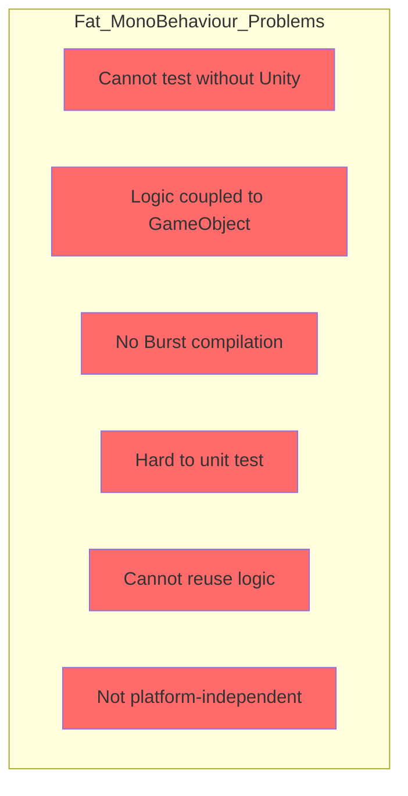
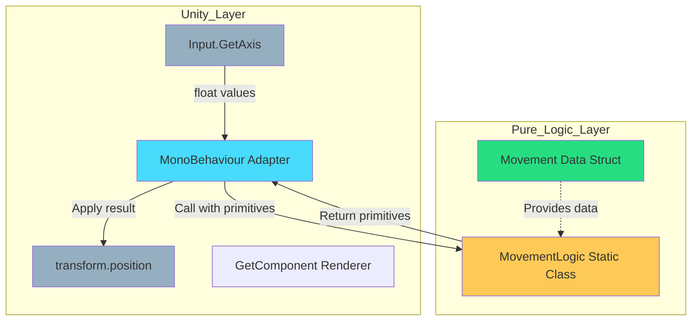
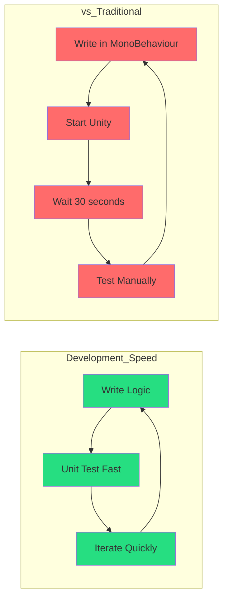
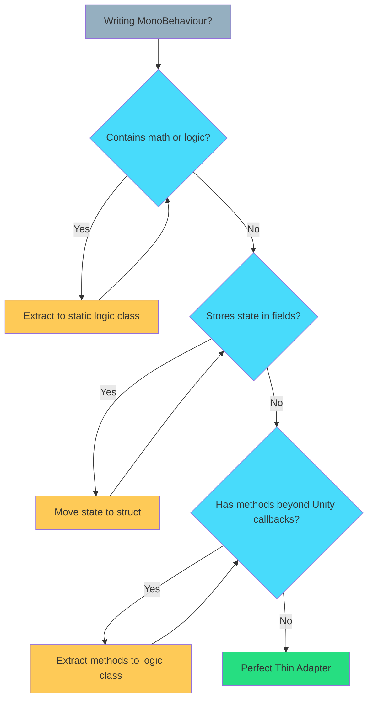

# Chapter 5: Unity Integration – The Thin Adapter Pattern

> **"MonoBehaviours are views, not models. They route input and display output. Nothing more."**  
> — *The Unity Adapter Contract*

---

## Table of Contents

1. [The Problem with Fat MonoBehaviours](#the-problem-with-fat-monobehaviours)
2. [What is a Thin Adapter?](#what-is-a-thin-adapter)
3. [The Rules](#the-rules)
4. [Adapter Responsibilities](#adapter-responsibilities)
5. [Real-World Examples](#real-world-examples)
6. [Testing Without Unity](#testing-without-unity)
7. [Common Mistakes](#common-mistakes)
8. [Performance Benefits](#performance-benefits)

---

## The Problem with Fat MonoBehaviours

Traditional Unity code puts all logic inside MonoBehaviours:

```csharp
// ❌ FAT MONOBEHAVIOUR - Everything in Unity class
public class PlayerController : MonoBehaviour
{
    public float speed = 5f;
    private float health = 100f;
    private Vector3 targetPosition;
    
    private void Update()
    {
        // Input handling
        float horizontal = Input.GetAxis("Horizontal");
        float vertical = Input.GetAxis("Vertical");
        
        // Movement logic
        Vector3 direction = new Vector3(horizontal, 0, vertical);
        if (direction.magnitude > 1f)
            direction.Normalize();
        
        transform.position += direction * speed * Time.deltaTime;
        
        // Combat logic
        if (Input.GetKeyDown(KeyCode.Space))
        {
            Attack();
        }
        
        // Health logic
        if (health <= 0)
        {
            Die();
        }
    }
    
    private void Attack()
    {
        // Attack logic mixed with Unity
    }
    
    private void Die()
    {
        Destroy(gameObject);
    }
}
```

### Why This Fails



**Problems:**
- ❌ Can't test without starting Unity
- ❌ Logic dies when GameObject is destroyed
- ❌ Can't use in Burst jobs
- ❌ Not portable to other platforms
- ❌ Violates Data-Logic-Extension Triad

---

## What is a Thin Adapter?

A **Thin Adapter** is a MonoBehaviour that:
1. **Routes input** to pure logic
2. **Reads results** from pure logic
3. **Updates Unity APIs** (Transform, Renderer, etc.)
4. **Contains ZERO logic**

### The Architecture



---

## The Rules

### Rule 1: No Logic in MonoBehaviour

```csharp
// ❌ WRONG - Logic in MonoBehaviour
public class EnemyAI : MonoBehaviour
{
    private void Update()
    {
        if (Vector3.Distance(transform.position, player.position) < 5f)
        {
            // Logic in Unity class!
            transform.LookAt(player);
            transform.position = Vector3.MoveTowards(
                transform.position, 
                player.position, 
                speed * Time.deltaTime
            );
        }
    }
}

// ✅ CORRECT - Logic extracted
public class EnemyAI : MonoBehaviour
{
    private Vector3 position;
    private Vector3 targetPosition;
    
    private void Update()
    {
        // Pure input
        float deltaTime = Time.deltaTime;
        
        // Pure logic call
        if (AILogic.TryMoveToward(
            ref position, 
            targetPosition, 
            speed, 
            deltaTime, 
            out Vector3 newPosition))
        {
            // Pure output
            transform.position = newPosition;
        }
    }
}
```

---

### Rule 2: Only Unity APIs in MonoBehaviour

**Allowed:**
- `Input.*`
- `Time.*`
- `transform.*`
- `GetComponent<T>()`
- `Instantiate()`, `Destroy()`
- Physics queries (as input)

**Forbidden:**
- Math calculations
- State machines
- AI decisions
- Combat formulas
- Inventory management

```csharp
// ❌ WRONG
public class ProjectileController : MonoBehaviour
{
    private void Update()
    {
        // Math logic in MonoBehaviour!
        float distance = Vector3.Distance(transform.position, target);
        float speed = Mathf.Lerp(minSpeed, maxSpeed, distance / maxDistance);
        transform.position = Vector3.MoveTowards(transform.position, target, speed * Time.deltaTime);
    }
}

// ✅ CORRECT
public class ProjectileController : MonoBehaviour
{
    private Vector3 position;
    private Vector3 velocity;
    
    private void Update()
    {
        // Pure logic
        ProjectileLogic.UpdatePosition(
            ref position,
            ref velocity,
            targetPosition,
            Time.deltaTime
        );
        
        // Unity output only
        transform.position = position;
    }
}
```

---

### Rule 3: No Fields, Only Properties to Data

```csharp
// ❌ WRONG - State stored in MonoBehaviour
public class Weapon : MonoBehaviour
{
    private int ammo = 30;
    private float fireRate = 0.1f;
    private float lastFireTime;
}

// ✅ CORRECT - State in struct, MonoBehaviour references it
public class Weapon : MonoBehaviour
{
    private WeaponData data; // Struct
    
    private void Start()
    {
        data = new WeaponData(ammo: 30, fireRate: 0.1f);
    }
}
```

---

## Adapter Responsibilities

### 1. Input Collection

```csharp
public class MovementAdapter : MonoBehaviour
{
    private MovementData movement;
    
    private void Update()
    {
        // ✅ Adapter collects input
        float horizontal = Input.GetAxis("Horizontal");
        float vertical = Input.GetAxis("Vertical");
        float deltaTime = Time.deltaTime;
        
        // ✅ Pass to logic
        MovementLogic.ProcessInput(
            ref movement.Position,
            ref movement.Velocity,
            horizontal,
            vertical,
            movement.Speed,
            deltaTime
        );
        
        // ✅ Apply to Unity
        transform.position = movement.Position;
    }
}
```

---

### 2. Output Application

```csharp
public class RotationAdapter : MonoBehaviour
{
    private RotationData rotation;
    
    private void Update()
    {
        // ✅ Logic calculates
        RotationLogic.UpdateRotation(
            ref rotation.CurrentAngle,
            rotation.TargetAngle,
            rotation.RotationSpeed,
            Time.deltaTime
        );
        
        // ✅ Adapter applies to Unity
        transform.rotation = Quaternion.Euler(0, rotation.CurrentAngle, 0);
    }
}
```

---

### 3. Event Translation

```csharp
public class InteractionAdapter : MonoBehaviour
{
    private InteractionData interaction;
    
    private void OnTriggerEnter(Collider other)
    {
        // ✅ Translate Unity event to logic call
        if (InteractionLogic.TryStartInteraction(
            ref interaction.State,
            other.gameObject.GetInstanceID()))
        {
            // ✅ Feedback to Unity
            Debug.Log($"Interaction started with {other.name}");
        }
    }
}
```

---

## Real-World Examples

### Example 1: Camera Follow System

#### The Data

```csharp
[Serializable]
[StructLayout(LayoutKind.Sequential)]
public struct CameraFollowData
{
    public Vector3 Position;
    public Vector3 TargetPosition;
    public float SmoothSpeed;
    public Vector3 Offset;
}
```

#### The Logic

```csharp
public static class CameraLogic
{
    [MethodImpl(MethodImplOptions.AggressiveInlining)]
    public static void FollowTarget(
        ref Vector3 position,
        Vector3 targetPosition,
        Vector3 offset,
        float smoothSpeed,
        float deltaTime)
    {
        if (smoothSpeed <= 0) return;
        if (deltaTime <= 0) return;
        
        Vector3 desiredPosition = targetPosition + offset;
        Vector3 smoothedPosition = Vector3.Lerp(
            position, 
            desiredPosition, 
            smoothSpeed * deltaTime
        );
        
        position = smoothedPosition;
    }
}
```

#### The Adapter

```csharp
public class CameraFollowAdapter : MonoBehaviour
{
    [SerializeField] private Transform target;
    [SerializeField] private Vector3 offset = new Vector3(0, 5, -10);
    [SerializeField] private float smoothSpeed = 5f;
    
    private CameraFollowData data;
    
    private void Start()
    {
        data = new CameraFollowData
        {
            Position = transform.position,
            Offset = offset,
            SmoothSpeed = smoothSpeed
        };
    }
    
    private void LateUpdate()
    {
        if (target == null) return;
        
        // ✅ Pure input
        Vector3 targetPos = target.position;
        float deltaTime = Time.deltaTime;
        
        // ✅ Pure logic
        CameraLogic.FollowTarget(
            ref data.Position,
            targetPos,
            data.Offset,
            data.SmoothSpeed,
            deltaTime
        );
        
        // ✅ Pure output
        transform.position = data.Position;
    }
}
```

---

### Example 2: Spawn Manager

#### The Data

```csharp
[Serializable]
[StructLayout(LayoutKind.Sequential)]
public struct SpawnData
{
    public float Timer;
    public float SpawnInterval;
    public int SpawnCount;
    public int MaxSpawns;
}
```

#### The Logic

```csharp
public static class SpawnLogic
{
    [MethodImpl(MethodImplOptions.AggressiveInlining)]
    public static bool TrySpawn(
        ref float timer,
        float spawnInterval,
        ref int spawnCount,
        int maxSpawns,
        float deltaTime)
    {
        if (spawnCount >= maxSpawns) return false;
        if (spawnInterval <= 0) return false;
        
        timer += deltaTime;
        
        if (timer >= spawnInterval)
        {
            timer = 0;
            spawnCount++;
            return true;
        }
        
        return false;
    }
}
```

#### The Adapter

```csharp
public class SpawnManagerAdapter : MonoBehaviour
{
    [SerializeField] private GameObject prefab;
    [SerializeField] private Transform spawnPoint;
    [SerializeField] private float spawnInterval = 2f;
    [SerializeField] private int maxSpawns = 10;
    
    private SpawnData data;
    
    private void Start()
    {
        data = new SpawnData
        {
            SpawnInterval = spawnInterval,
            MaxSpawns = maxSpawns
        };
    }
    
    private void Update()
    {
        // ✅ Pure logic
        if (SpawnLogic.TrySpawn(
            ref data.Timer,
            data.SpawnInterval,
            ref data.SpawnCount,
            data.MaxSpawns,
            Time.deltaTime))
        {
            // ✅ Unity API call only
            Instantiate(prefab, spawnPoint.position, Quaternion.identity);
        }
    }
}
```

---

### Example 3: Particle Effect Trigger

#### The Data

```csharp
[Serializable]
[StructLayout(LayoutKind.Sequential)]
public struct EffectTriggerData
{
    public float Intensity;
    public float Threshold;
    public bool IsActive;
}
```

#### The Logic

```csharp
public static class EffectLogic
{
    [MethodImpl(MethodImplOptions.AggressiveInlining)]
    public static bool ShouldTriggerEffect(
        float intensity,
        float threshold,
        bool isActive)
    {
        if (isActive) return false;
        if (threshold <= 0) return false;
        return intensity >= threshold;
    }
    
    [MethodImpl(MethodImplOptions.AggressiveInlining)]
    public static void UpdateIntensity(
        ref float intensity,
        float targetIntensity,
        float deltaTime)
    {
        if (deltaTime <= 0) return;
        
        intensity = Mathf.MoveTowards(
            intensity,
            targetIntensity,
            deltaTime
        );
    }
}
```

#### The Adapter

```csharp
public class EffectTriggerAdapter : MonoBehaviour
{
    [SerializeField] private ParticleSystem particles;
    [SerializeField] private float threshold = 0.5f;
    
    private EffectTriggerData data;
    
    private void Start()
    {
        data = new EffectTriggerData
        {
            Threshold = threshold
        };
    }
    
    public void SetIntensity(float target)
    {
        EffectLogic.UpdateIntensity(
            ref data.Intensity,
            target,
            Time.deltaTime
        );
        
        // Check trigger
        if (EffectLogic.ShouldTriggerEffect(
            data.Intensity,
            data.Threshold,
            data.IsActive))
        {
            data.IsActive = true;
            particles.Play(); // Unity API
        }
    }
    
    private void OnParticleSystemStopped()
    {
        data.IsActive = false;
    }
}
```

---

## Testing Without Unity

### Pure Logic Tests (No Unity Required)

```csharp
using NUnit.Framework;

public class CameraLogicTests
{
    [Test]
    public void FollowTarget_MovesTowardTarget()
    {
        // Arrange
        Vector3 position = new Vector3(0, 0, 0);
        Vector3 target = new Vector3(10, 0, 0);
        Vector3 offset = Vector3.zero;
        float smoothSpeed = 1f;
        float deltaTime = 1f;
        
        // Act
        CameraLogic.FollowTarget(
            ref position,
            target,
            offset,
            smoothSpeed,
            deltaTime
        );
        
        // Assert
        Assert.Greater(position.x, 0);
        Assert.Less(position.x, 10);
    }
    
    [Test]
    public void FollowTarget_IgnoresInvalidDeltaTime()
    {
        Vector3 position = Vector3.zero;
        Vector3 original = position;
        
        CameraLogic.FollowTarget(
            ref position,
            Vector3.one,
            Vector3.zero,
            1f,
            0f // Invalid deltaTime
        );
        
        Assert.AreEqual(original, position);
    }
}
```

### Adapter Tests (Requires Unity Test Framework)

```csharp
using NUnit.Framework;
using UnityEngine;
using UnityEngine.TestTools;

public class CameraFollowAdapterTests
{
    [UnityTest]
    public IEnumerator Adapter_FollowsTarget()
    {
        // Arrange
        var cameraGO = new GameObject("Camera");
        var adapter = cameraGO.AddComponent<CameraFollowAdapter>();
        
        var targetGO = new GameObject("Target");
        targetGO.transform.position = new Vector3(10, 0, 0);
        
        // Act
        yield return new WaitForSeconds(1f);
        
        // Assert
        Assert.Greater(cameraGO.transform.position.x, 0);
        
        // Cleanup
        Object.Destroy(cameraGO);
        Object.Destroy(targetGO);
    }
}
```

**Key Difference:**
- ✅ **Logic tests** = Fast, no Unity, run in CI/CD
- ⚠️ **Adapter tests** = Slow, require Unity, integration tests only

---

## Common Mistakes

### Mistake 1: Logic Leaking into Adapter

```csharp
// ❌ WRONG
public class BadAdapter : MonoBehaviour
{
    private void Update()
    {
        // Logic in adapter!
        if (health <= 0)
        {
            isDead = true;
            speed = 0;
        }
        
        transform.position += velocity * Time.deltaTime;
    }
}

// ✅ CORRECT
public class GoodAdapter : MonoBehaviour
{
    private CharacterData data;
    
    private void Update()
    {
        // Pure logic
        CharacterLogic.UpdateState(ref data, Time.deltaTime);
        
        // Pure output
        transform.position = data.Position;
    }
}
```

---

### Mistake 2: Storing State in MonoBehaviour

```csharp
// ❌ WRONG - State in MonoBehaviour
public class BadWeapon : MonoBehaviour
{
    private int currentAmmo;
    private float lastFireTime;
    private bool isReloading;
}

// ✅ CORRECT - State in struct
public class GoodWeapon : MonoBehaviour
{
    private WeaponData data; // All state here
    
    // MonoBehaviour is just a shell
}
```

---

### Mistake 3: Using MonoBehaviour Methods for Logic

```csharp
// ❌ WRONG
public class BadEnemy : MonoBehaviour
{
    private bool CanSeePlayer()
    {
        // Logic method in MonoBehaviour!
        return Vector3.Distance(transform.position, player.position) < viewRange;
    }
}

// ✅ CORRECT
public class GoodEnemy : MonoBehaviour
{
    private void Update()
    {
        bool canSee = VisionLogic.CanSeeTarget(
            transform.position,
            playerPosition,
            viewRange
        );
        
        if (canSee)
        {
            // React
        }
    }
}
```

---

## Performance Benefits

### 1. Logic is Burst-Compatible

```csharp
[BurstCompile]
public struct CameraFollowJob : IJobParallelFor
{
    public NativeArray<Vector3> Positions;
    [ReadOnly] public NativeArray<Vector3> Targets;
    public Vector3 Offset;
    public float SmoothSpeed;
    public float DeltaTime;
    
    public void Execute(int index)
    {
        Vector3 pos = Positions[index];
        
        // ✅ Same logic, Burst-compiled!
        CameraLogic.FollowTarget(
            ref pos,
            Targets[index],
            Offset,
            SmoothSpeed,
            DeltaTime
        );
        
        Positions[index] = pos;
    }
}
```

---

### 2. Logic is Testable



---

### 3. Logic is Reusable

```csharp
// ✅ Same logic, multiple contexts

// In Unity MonoBehaviour
public class CameraAdapter : MonoBehaviour
{
    void Update() => CameraLogic.FollowTarget(...);
}

// In Burst Job
[BurstCompile]
public struct CameraJob : IJobParallelFor
{
    void Execute(int i) => CameraLogic.FollowTarget(...);
}

// In Unit Test
[Test]
public void TestCamera()
{
    CameraLogic.FollowTarget(...);
}

// In Headless Server
public class ServerCamera
{
    void Tick() => CameraLogic.FollowTarget(...);
}
```

---

## Summary

### The Thin Adapter Checklist



### Key Principles

| Principle | Rule |
|-----------|------|
| **Zero logic** | All calculations in static classes |
| **Zero state** | All data in structs |
| **Input only** | Collect from Unity APIs |
| **Output only** | Apply to Unity APIs |
| **Event routing** | Translate Unity events to logic calls |

### Template

```csharp
// THE THIN ADAPTER PATTERN

// 1. The Data
[Serializable]
[StructLayout(LayoutKind.Sequential)]
public struct MySystemData
{
    public float Value;
    public bool IsActive;
}

// 2. The Logic
public static class MySystemLogic
{
    [MethodImpl(MethodImplOptions.AggressiveInlining)]
    public static void Update(ref float value, float deltaTime)
    {
        if (!IsActive) return;
        value += deltaTime;
    }
}

// 3. The Adapter (MonoBehaviour)
public class MySystemAdapter : MonoBehaviour
{
    private MySystemData data;
    
    private void Update()
    {
        // Input
        float dt = Time.deltaTime;
        
        // Logic
        MySystemLogic.Update(ref data.Value, dt);
        
        // Output
        transform.position = new Vector3(data.Value, 0, 0);
    }
}
```

---

**Previous:** [← Chapter 4: Burst Compatibility](./04-burst-compatibility.md)  
**Next:** [Chapter 6: The AV Pattern - Cached Components →](./06-av-pattern.md)

---

*MonoBehaviours are thin adapters. They route, translate, and apply. Never logic. Never state.*
