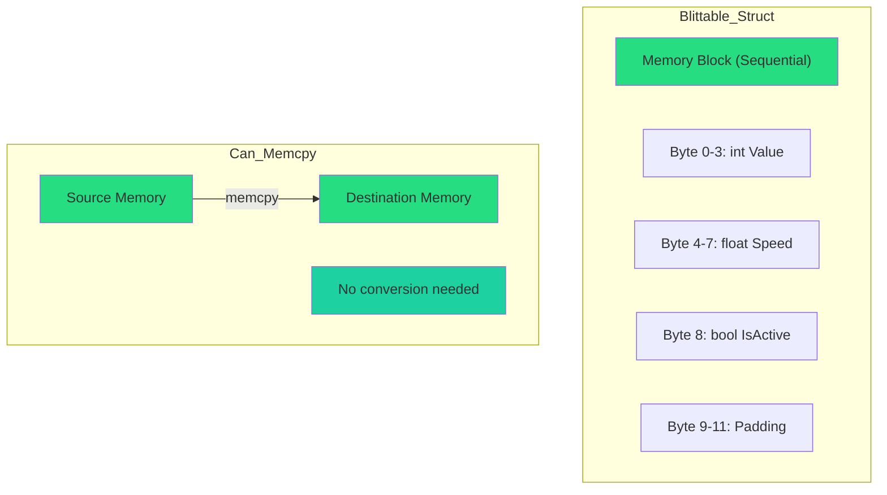
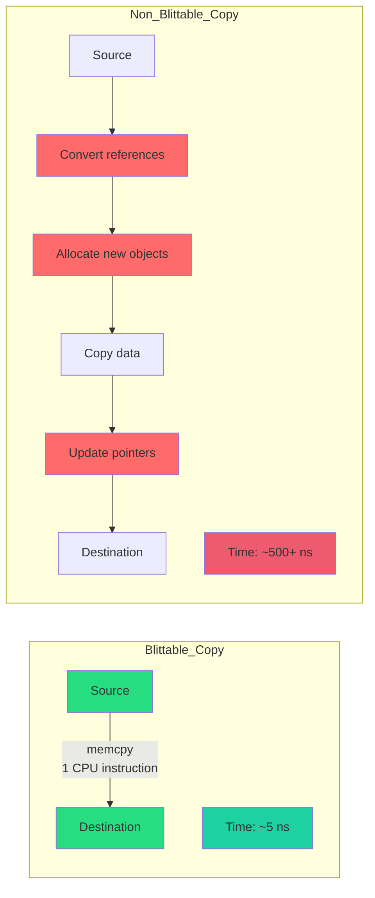
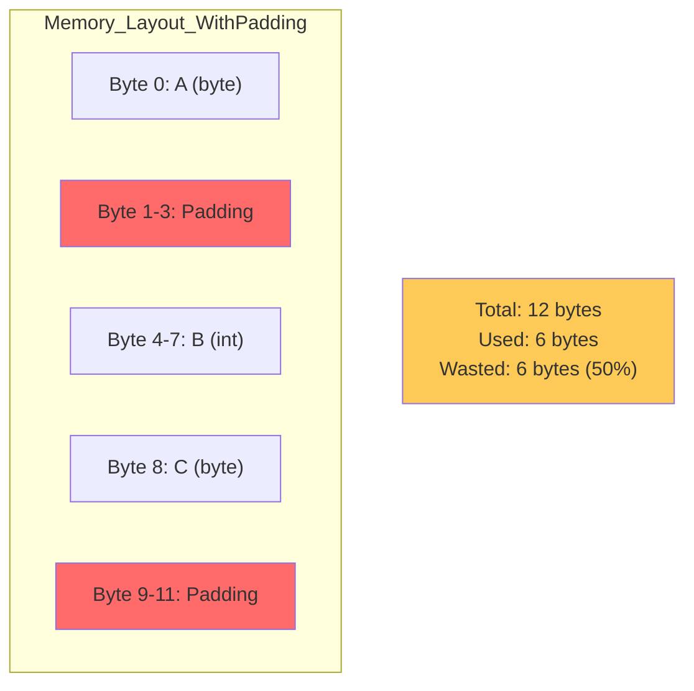
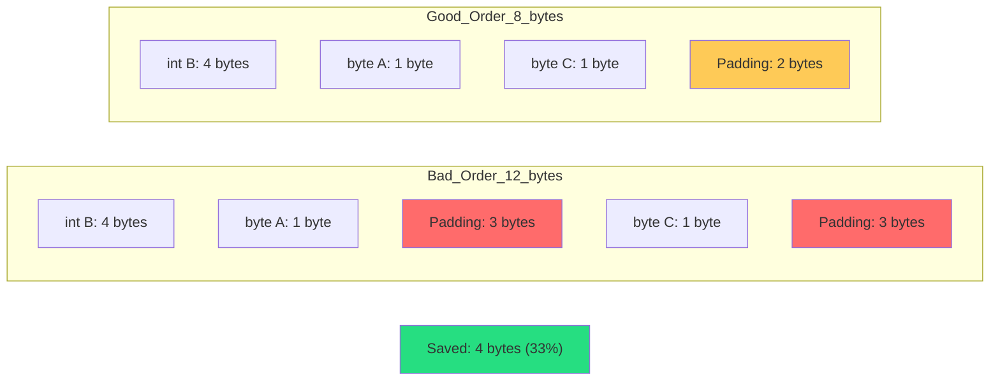
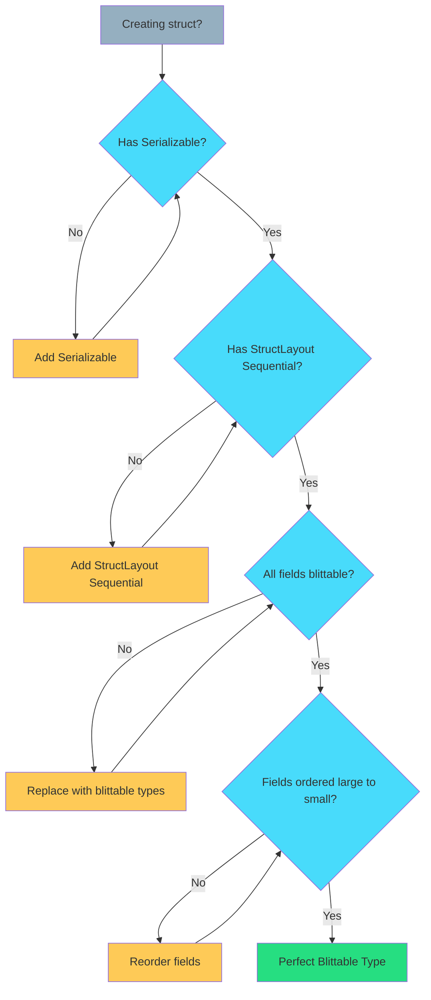

# Chapter 7: Data Structure – Blittable Types & Memory Layout

> **"If it can't memcpy, it's not DOD. Sequential layout. No references. Period."**  
> — *The Memory Contract*

---

## Table of Contents

1. [What are Blittable Types?](#what-are-blittable-types)
2. [Why Blittable Matters](#why-blittable-matters)
3. [The Rules](#the-rules)
4. [Memory Layout Deep Dive](#memory-layout-deep-dive)
5. [Blittable vs Non-Blittable](#blittable-vs-non-blittable)
6. [Practical Examples](#practical-examples)
7. [Common Mistakes](#common-mistakes)
8. [Validation & Testing](#validation--testing)

---

## What are Blittable Types?

**Blittable** = Can be copied byte-by-byte between managed and unmanaged memory without conversion.

### The Definition

```csharp
// ✅ BLITTABLE - Can memcpy directly
[Serializable]
[StructLayout(LayoutKind.Sequential)]
public struct BlittableData
{
    public int Value;           // 4 bytes
    public float Speed;         // 4 bytes
    public bool IsActive;       // 1 byte
    // Total: 9 bytes (+ padding)
}

// ❌ NON-BLITTABLE - Contains references
public struct NonBlittable
{
    public string Name;         // Reference type!
    public int[] Values;        // Reference type!
    public object Data;         // Reference type!
}
```

### Memory Representation



---

## Why Blittable Matters

### 1. Burst Compilation

```csharp
// ✅ BLITTABLE - Burst compatible
[BurstCompile]
public struct ProcessJob : IJobParallelFor
{
    public NativeArray<BlittableData> Data;
    
    public void Execute(int index)
    {
        var item = Data[index]; // Direct memory access
        item.Value *= 2;
        Data[index] = item;
    }
}

// ❌ NON-BLITTABLE - Burst error!
[BurstCompile]
public struct BadJob : IJobParallelFor
{
    public NativeArray<NonBlittable> Data; // ERROR: Not blittable!
    public void Execute(int index) { }
}
```

---

### 2. NativeContainer Compatibility

```csharp
// ✅ WORKS - Blittable type
NativeArray<BlittableData> array = new NativeArray<BlittableData>(
    1000, 
    Allocator.Persistent
);

// ❌ COMPILE ERROR - Non-blittable type
NativeArray<NonBlittable> badArray = new NativeArray<NonBlittable>(
    1000, 
    Allocator.Persistent
);
// Error: NonBlittable must be blittable
```

---

### 3. memcpy Performance



**Blittable:** 1 memcpy = ~5 ns  
**Non-Blittable:** Convert + allocate = ~500+ ns  
**Result:** 100x slower for non-blittable!

---

## The Rules

### Rule 1: [Serializable] Required

```csharp
// ❌ WRONG - Missing attribute
public struct BadData
{
    public int Value;
}

// ✅ CORRECT - Serializable attribute
[Serializable]
public struct GoodData
{
    public int Value;
}
```

**Why?** Unity's serialization system requires this for struct fields in MonoBehaviours.

---

### Rule 2: [StructLayout(LayoutKind.Sequential)] Required

```csharp
// ❌ WRONG - No layout control
[Serializable]
public struct BadLayout
{
    public int A;
    public byte B;
    public int C;
}
// Compiler may reorder: C, A, B for alignment

// ✅ CORRECT - Sequential layout
[Serializable]
[StructLayout(LayoutKind.Sequential)]
public struct GoodLayout
{
    public int A;    // Offset 0
    public byte B;   // Offset 4
    public int C;    // Offset 8
}
// Layout guaranteed: A, B, C in order
```

---

### Rule 3: Only Blittable Fields

**Allowed:**
- Primitives: `int`, `float`, `double`, `bool`, `byte`, `short`, `long`, etc.
- Other blittable structs
- Fixed-size arrays (with `fixed` keyword)
- `Vector3`, `Vector2`, `Quaternion` (Unity's blittable types)

**Forbidden:**
- `string`
- `class` types
- `object`
- `T[]` (managed arrays)
- `List<T>`, `Dictionary<T,K>`
- References of any kind

```csharp
// ❌ NON-BLITTABLE
[Serializable]
public struct Bad
{
    public string Name;      // ❌ Reference
    public int[] Values;     // ❌ Managed array
    public object Data;      // ❌ Reference
}

// ✅ BLITTABLE
[Serializable]
[StructLayout(LayoutKind.Sequential)]
public struct Good
{
    public int Id;           // ✅ Primitive
    public float Value;      // ✅ Primitive
    public Vector3 Position; // ✅ Blittable struct
}
```

---

## Memory Layout Deep Dive

### Alignment & Padding

```csharp
[StructLayout(LayoutKind.Sequential)]
public struct WithPadding
{
    public byte A;   // 1 byte
    // 3 bytes padding inserted here
    public int B;    // 4 bytes (aligned to 4-byte boundary)
    public byte C;   // 1 byte
    // 3 bytes padding at end
}
// Total: 12 bytes (not 6!)
```

### Visualization



---

### Optimal Layout

```csharp
// ❌ BAD - 50% wasted
[StructLayout(LayoutKind.Sequential)]
public struct BadOrder
{
    public byte A;   // 1 byte + 3 padding
    public int B;    // 4 bytes
    public byte C;   // 1 byte + 3 padding
}
// Total: 12 bytes

// ✅ GOOD - Minimal waste
[StructLayout(LayoutKind.Sequential)]
public struct GoodOrder
{
    public int B;    // 4 bytes
    public byte A;   // 1 byte
    public byte C;   // 1 byte
    // 2 bytes padding at end
}
// Total: 8 bytes
```

### Layout Comparison



**Rule:** Order fields from largest to smallest to minimize padding.

---

### Pack Attribute (Advanced)

```csharp
// Pack = 1: No padding, but slower access
[StructLayout(LayoutKind.Sequential, Pack = 1)]
public struct Packed
{
    public byte A;   // Byte 0
    public int B;    // Byte 1-4 (unaligned!)
    public byte C;   // Byte 5
}
// Total: 6 bytes (no padding)
// ⚠️ CPU may need multiple reads for unaligned int

// Default Pack = 8: Aligned access, faster
[StructLayout(LayoutKind.Sequential)]
public struct Aligned
{
    public byte A;   // Byte 0
    // 3 bytes padding
    public int B;    // Byte 4-7 (aligned)
    public byte C;   // Byte 8
}
// Total: 12 bytes (with padding)
// ✅ CPU reads int in single operation
```

**Recommendation:** Use default packing (Pack = 8) unless memory is extremely constrained.

---

## Blittable vs Non-Blittable

### Type Compatibility Chart

| Type | Blittable? | Notes |
|------|-----------|-------|
| `int`, `float`, `double` | ✅ Yes | All primitives |
| `bool` | ✅ Yes | 1 byte |
| `Vector3`, `Vector2` | ✅ Yes | Unity structs |
| `Quaternion` | ✅ Yes | Unity struct |
| `Color` | ✅ Yes | Unity struct |
| `string` | ❌ No | Reference type |
| `int[]` | ❌ No | Managed array |
| `List<T>` | ❌ No | Managed collection |
| `object` | ❌ No | Reference type |
| `enum` | ✅ Yes | Backed by int |
| `class` | ❌ No | Reference type |

---

### Replacement Patterns

```csharp
// ❌ NON-BLITTABLE - string
public struct BadString
{
    public string Name;
}

// ✅ BLITTABLE - FixedString
using Unity.Collections;

[Serializable]
[StructLayout(LayoutKind.Sequential)]
public struct GoodString
{
    public FixedString64Bytes Name; // Unmanaged, blittable
}
```

```csharp
// ❌ NON-BLITTABLE - managed array
public struct BadArray
{
    public int[] Values;
}

// ✅ BLITTABLE - fixed size array
[Serializable]
[StructLayout(LayoutKind.Sequential)]
public unsafe struct GoodArray
{
    public fixed int Values[10]; // Fixed-size, inline
}

// Or use NativeArray in jobs
public struct JobData
{
    public NativeArray<int> Values; // Blittable in jobs
}
```

---

## Practical Examples

### Example 1: Entity Data

```csharp
// ✅ PERFECT BLITTABLE ENTITY
[Serializable]
[StructLayout(LayoutKind.Sequential)]
public struct EntityData
{
    // Largest first
    public Vector3 Position;     // 12 bytes
    public Vector3 Velocity;     // 12 bytes
    public Quaternion Rotation;  // 16 bytes
    
    public float Speed;          // 4 bytes
    public float Health;         // 4 bytes
    public int EntityId;         // 4 bytes
    
    public byte TeamId;          // 1 byte
    public bool IsActive;        // 1 byte
    // 2 bytes padding at end
}
// Total: 56 bytes (well-aligned)
```

---

### Example 2: Projectile Data

```csharp
[Serializable]
[StructLayout(LayoutKind.Sequential)]
public struct ProjectileData
{
    public Vector3 Position;     // 12 bytes
    public Vector3 Direction;    // 12 bytes
    
    public float Speed;          // 4 bytes
    public float Lifetime;       // 4 bytes
    public int OwnerId;          // 4 bytes
    
    public bool IsActive;        // 1 byte
    // 3 bytes padding
}
// Total: 40 bytes
```

---

### Example 3: Grid Cell Data

```csharp
[Serializable]
[StructLayout(LayoutKind.Sequential)]
public struct GridCellData
{
    public int X;                // 4 bytes
    public int Y;                // 4 bytes
    public int Z;                // 4 bytes
    
    public byte CellType;        // 1 byte
    public byte Height;          // 1 byte
    public bool IsBlocked;       // 1 byte
    public bool IsVisible;       // 1 byte
}
// Total: 16 bytes (perfect alignment)
```

---

## Common Mistakes

### Mistake 1: Forgetting Attributes

```csharp
// ❌ WRONG - No attributes
public struct Incomplete
{
    public int Value;
}

// ✅ CORRECT - Both attributes
[Serializable]
[StructLayout(LayoutKind.Sequential)]
public struct Complete
{
    public int Value;
}
```

---

### Mistake 2: Including References

```csharp
// ❌ WRONG - Contains reference
[Serializable]
[StructLayout(LayoutKind.Sequential)]
public struct WithReference
{
    public int Value;
    public string Name; // ❌ Reference type!
}

// ✅ CORRECT - All value types
[Serializable]
[StructLayout(LayoutKind.Sequential)]
public struct NoReferences
{
    public int Value;
    public FixedString32Bytes Name; // ✅ Value type
}
```

---

### Mistake 3: Poor Field Ordering

```csharp
// ❌ BAD - Wasted space
[StructLayout(LayoutKind.Sequential)]
public struct WastedSpace
{
    public byte A;    // 1 + 3 padding
    public int B;     // 4
    public byte C;    // 1 + 3 padding
    public int D;     // 4
}
// Total: 16 bytes (8 bytes wasted)

// ✅ GOOD - Minimal waste
[StructLayout(LayoutKind.Sequential)]
public struct CompactLayout
{
    public int B;     // 4
    public int D;     // 4
    public byte A;    // 1
    public byte C;    // 1
    // 2 bytes padding
}
// Total: 12 bytes (2 bytes wasted)
```

---

## Validation & Testing

### Compile-Time Validation

```csharp
using Unity.Collections.LowLevel.Unsafe;

// Check if type is blittable
public static class BlittableValidator
{
    public static bool IsBlittable<T>() where T : struct
    {
        return UnsafeUtility.IsBlittable<T>();
    }
}

// Usage
[Test]
public void EntityData_IsBlittable()
{
    Assert.IsTrue(BlittableValidator.IsBlittable<EntityData>());
}
```

---

### Runtime Size Checking

```csharp
using System.Runtime.InteropServices;

[Test]
public void EntityData_HasExpectedSize()
{
    int size = Marshal.SizeOf<EntityData>();
    Assert.AreEqual(56, size);
}

[Test]
public void ProjectileData_HasExpectedSize()
{
    int size = Marshal.SizeOf<ProjectileData>();
    Assert.AreEqual(40, size);
}
```

---

### Layout Inspector

```csharp
using System.Runtime.InteropServices;
using Unity.Collections.LowLevel.Unsafe;

public static class LayoutInspector
{
    public static void PrintLayout<T>() where T : struct
    {
        Debug.Log($"Type: {typeof(T).Name}");
        Debug.Log($"Size: {UnsafeUtility.SizeOf<T>()} bytes");
        Debug.Log($"Alignment: {UnsafeUtility.AlignOf<T>()} bytes");
        Debug.Log($"Is Blittable: {UnsafeUtility.IsBlittable<T>()}");
        
        foreach (var field in typeof(T).GetFields())
        {
            int offset = (int)Marshal.OffsetOf<T>(field.Name);
            Debug.Log($"  {field.Name}: Offset {offset}, Type {field.FieldType.Name}");
        }
    }
}

// Usage
LayoutInspector.PrintLayout<EntityData>();
```

---

## Summary

### Blittable Type Checklist



### Key Principles

| Principle | Rule |
|-----------|------|
| **Serializable** | Always add `[Serializable]` |
| **Sequential** | Always add `[StructLayout(LayoutKind.Sequential)]` |
| **No references** | Only primitives and other blittable structs |
| **Order matters** | Largest fields first to minimize padding |
| **Validate** | Use `UnsafeUtility.IsBlittable<T>()` in tests |

### Template

```csharp
// THE BLITTABLE TYPE TEMPLATE

using System;
using System.Runtime.InteropServices;
using UnityEngine;

[Serializable]
[StructLayout(LayoutKind.Sequential)]
public struct MyBlittableData
{
    // Order: Largest to smallest
    
    // 16 bytes
    public Quaternion Rotation;
    
    // 12 bytes each
    public Vector3 Position;
    public Vector3 Velocity;
    
    // 4 bytes each
    public float Speed;
    public int Id;
    
    // 1 byte each
    public byte Type;
    public bool IsActive;
    // Compiler adds padding to align to 4/8 byte boundary
}

// Validation test
[Test]
public void MyData_IsBlittable()
{
    Assert.IsTrue(UnsafeUtility.IsBlittable<MyBlittableData>());
}
```

---

**Previous:** [← Chapter 6: AV Pattern](./06-av-pattern.md)  
**Next:** [Chapter 8: Assembly Separation →](./08-assembly-separation.md)

---

*Blittable = memcpy-able. Sequential layout. No references. Always validate.*
