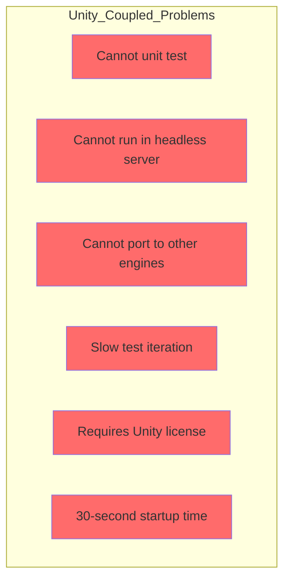
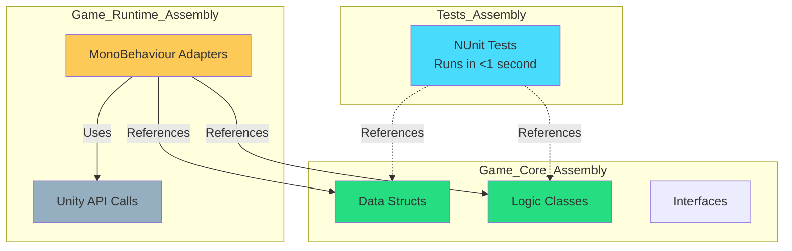
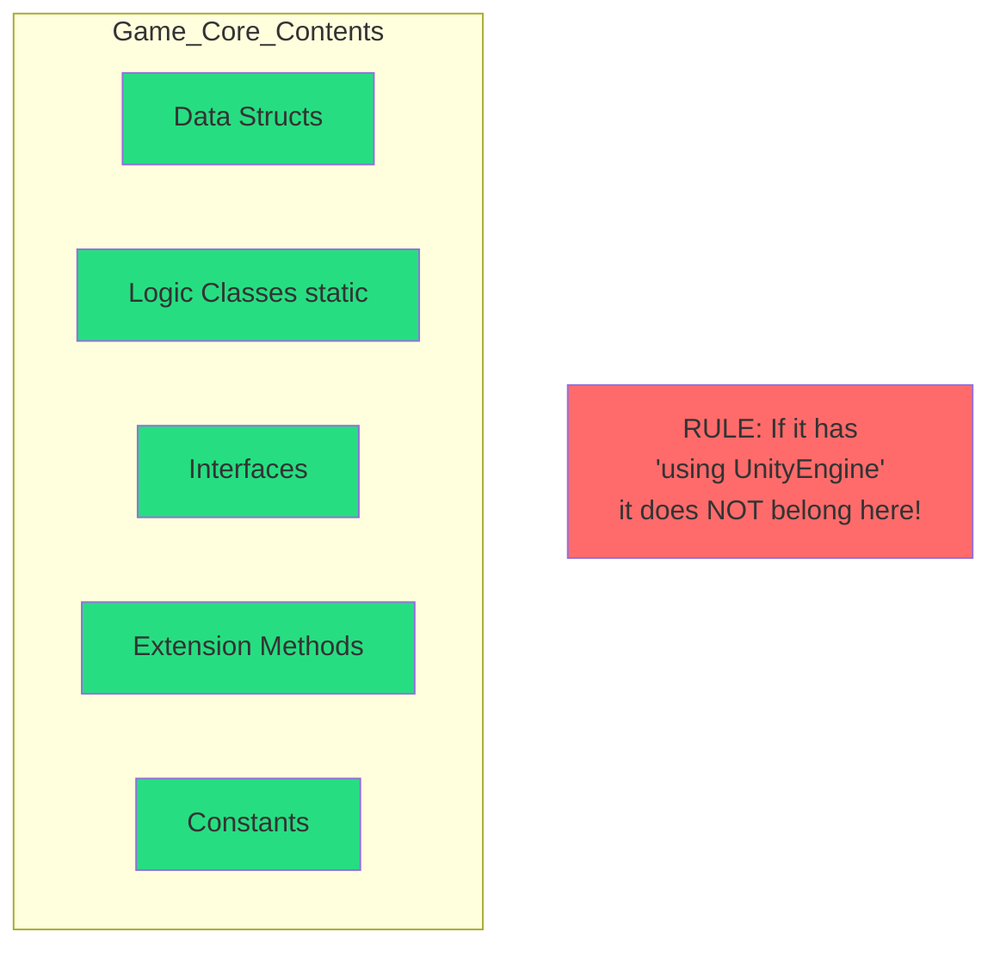
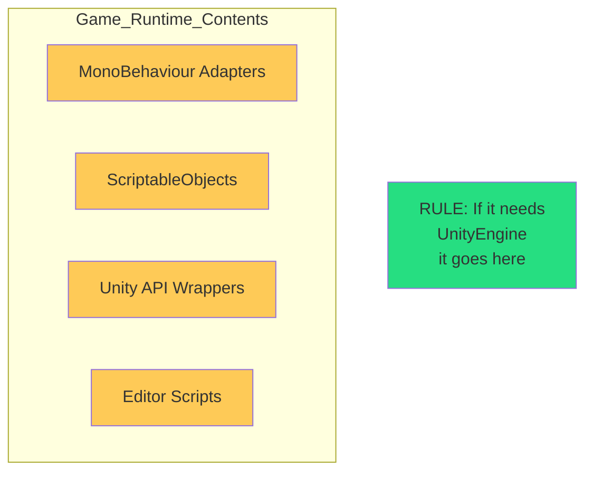
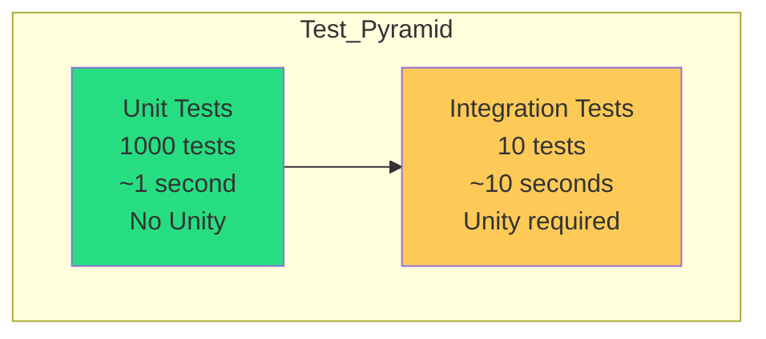
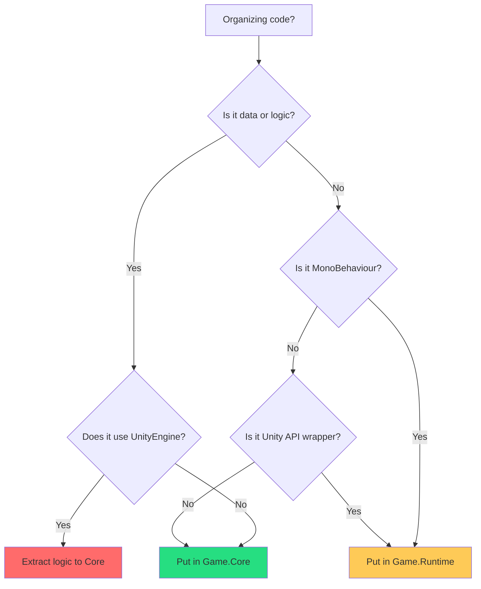
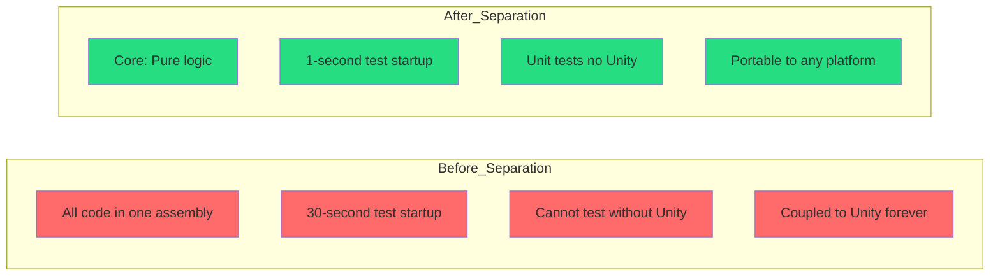

# Chapter 8: Architecture – Assembly Separation (Core vs. Runtime)

> **"Game logic should compile without UnityEngine.dll. Test without Unity. Deploy everywhere."**  
> — *The Platform Independence Principle*

---

## Table of Contents

1. [The Problem with Unity-Coupled Code](#the-problem-with-unity-coupled-code)
2. [The Two-Assembly Architecture](#the-two-assembly-architecture)
3. [Assembly Definition Files](#assembly-definition-files)
4. [What Goes Where](#what-goes-where)
5. [Real-World Project Structure](#real-world-project-structure)
6. [Testing Strategy](#testing-strategy)
7. [Common Mistakes](#common-mistakes)
8. [Migration Guide](#migration-guide)

---

## The Problem with Unity-Coupled Code

Traditional Unity projects tightly couple game logic to Unity:

```csharp
// ❌ UNITY-COUPLED - Can't test without Unity
using UnityEngine;

public static class CombatSystem
{
    public static void ProcessAttack(GameObject attacker, GameObject target)
    {
        var attackerStats = attacker.GetComponent<StatsComponent>();
        var targetStats = target.GetComponent<StatsComponent>();
        
        float damage = attackerStats.AttackPower;
        targetStats.Health -= damage;
        
        if (targetStats.Health <= 0)
        {
            Object.Destroy(target);
        }
    }
}
```

### Why This Fails



---

## The Two-Assembly Architecture

Separate your code into two assemblies:

### Architecture Overview



---

### Assembly 1: Game.Core (Platform-Independent)

**Dependencies:** ZERO Unity dependencies  
**Contains:**
- Data structs
- Logic classes (static)
- Interfaces
- Extension methods

**Can Run:**
- ✅ In unit tests (NUnit)
- ✅ In headless servers
- ✅ In CI/CD pipelines
- ✅ On any .NET platform

```csharp
// ✅ GAME.CORE - Zero Unity dependencies
namespace Game.Core
{
    [Serializable]
    [StructLayout(LayoutKind.Sequential)]
    public struct CombatData
    {
        public float Health;
        public float AttackPower;
        public float Defense;
    }
    
    public static class CombatLogic
    {
        [MethodImpl(MethodImplOptions.AggressiveInlining)]
        public static bool TryApplyDamage(
            ref float health,
            float attackPower,
            float defense,
            out float damageDealt)
        {
            damageDealt = 0f;
            
            if (attackPower <= 0) return false;
            if (health <= 0) return false;
            
            damageDealt = Mathf.Max(0, attackPower - defense);
            health -= damageDealt;
            
            if (health < 0) health = 0;
            
            return true;
        }
    }
}
```

---

### Assembly 2: Game.Runtime (Unity Integration)

**Dependencies:** Game.Core + UnityEngine  
**Contains:**
- MonoBehaviour adapters
- Unity API calls
- ScriptableObjects
- Editor scripts

```csharp
// ✅ GAME.RUNTIME - Unity adapters only
using UnityEngine;
using Game.Core;

namespace Game.Runtime
{
    public class CombatAdapter : MonoBehaviour
    {
        [SerializeField] private CombatData combatData;
        
        public void TakeDamage(float attackPower, float defense)
        {
            if (CombatLogic.TryApplyDamage(
                ref combatData.Health,
                attackPower,
                defense,
                out float damageDealt))
            {
                Debug.Log($"Took {damageDealt} damage");
                
                if (combatData.Health <= 0)
                {
                    Destroy(gameObject); // Unity API
                }
            }
        }
    }
}
```

---

## Assembly Definition Files

### Step 1: Create Game.Core.asmdef

**Location:** `Assets/Scripts/Core/Game.Core.asmdef`

```json
{
    "name": "Game.Core",
    "rootNamespace": "Game.Core",
    "references": [],
    "includePlatforms": [],
    "excludePlatforms": [],
    "allowUnsafeCode": true,
    "overrideReferences": false,
    "precompiledReferences": [],
    "autoReferenced": true,
    "defineConstraints": [],
    "versionDefines": [],
    "noEngineReferences": true
}
```

**Key Setting:** `"noEngineReferences": true` - Prevents UnityEngine references!

---

### Step 2: Create Game.Runtime.asmdef

**Location:** `Assets/Scripts/Runtime/Game.Runtime.asmdef`

```json
{
    "name": "Game.Runtime",
    "rootNamespace": "Game.Runtime",
    "references": [
        "Game.Core"
    ],
    "includePlatforms": [],
    "excludePlatforms": [],
    "allowUnsafeCode": false,
    "overrideReferences": false,
    "precompiledReferences": [],
    "autoReferenced": true,
    "defineConstraints": [],
    "versionDefines": [],
    "noEngineReferences": false
}
```

**Key:** References `Game.Core` but allows Unity APIs.

---

### Step 3: Create Tests.asmdef

**Location:** `Assets/Tests/Game.Tests.asmdef`

```json
{
    "name": "Game.Tests",
    "rootNamespace": "Game.Tests",
    "references": [
        "Game.Core",
        "UnityEngine.TestRunner",
        "UnityEditor.TestRunner"
    ],
    "includePlatforms": [
        "Editor"
    ],
    "excludePlatforms": [],
    "allowUnsafeCode": false,
    "overrideReferences": true,
    "precompiledReferences": [
        "nunit.framework.dll"
    ],
    "autoReferenced": false,
    "defineConstraints": [
        "UNITY_INCLUDE_TESTS"
    ],
    "versionDefines": [],
    "noEngineReferences": false
}
```

---

## What Goes Where

### Game.Core Assembly



**Examples:**

✅ **YES - Goes in Game.Core**
```csharp
// Data
public struct PlayerData { }
public struct WeaponData { }

// Logic
public static class MovementLogic { }
public static class CombatLogic { }

// Interfaces
public interface IDamageable { }
public interface IInventory { }

// Extensions
public static class PlayerExtensions { }
```

❌ **NO - Goes in Game.Runtime**
```csharp
// MonoBehaviours
public class PlayerController : MonoBehaviour { }

// Unity APIs
public class ParticleManager : MonoBehaviour { }

// ScriptableObjects
public class WeaponConfig : ScriptableObject { }
```

---

### Game.Runtime Assembly



---

## Real-World Project Structure

```
Assets/
├── Scripts/
│   ├── Core/                          [Game.Core Assembly]
│   │   ├── Game.Core.asmdef
│   │   ├── Data/
│   │   │   ├── PlayerData.cs
│   │   │   ├── WeaponData.cs
│   │   │   └── CombatData.cs
│   │   ├── Logic/
│   │   │   ├── MovementLogic.cs
│   │   │   ├── CombatLogic.cs
│   │   │   └── InventoryLogic.cs
│   │   ├── Interfaces/
│   │   │   ├── IDamageable.cs
│   │   │   └── IInteractable.cs
│   │   └── Extensions/
│   │       ├── PlayerExtensions.cs
│   │       └── WeaponExtensions.cs
│   │
│   └── Runtime/                       [Game.Runtime Assembly]
│       ├── Game.Runtime.asmdef
│       ├── Adapters/
│       │   ├── PlayerAdapter.cs
│       │   ├── WeaponAdapter.cs
│       │   └── CombatAdapter.cs
│       ├── Managers/
│       │   ├── GameManager.cs
│       │   └── InputManager.cs
│       └── ScriptableObjects/
│           └── GameConfig.cs
│
└── Tests/                             [Game.Tests Assembly]
    ├── Game.Tests.asmdef
    ├── Core/
    │   ├── MovementLogicTests.cs
    │   ├── CombatLogicTests.cs
    │   └── InventoryLogicTests.cs
    └── Runtime/
        └── IntegrationTests.cs
```

---

## Testing Strategy

### Unit Tests (Fast - No Unity)

```csharp
// Tests/Core/CombatLogicTests.cs
using NUnit.Framework;
using Game.Core;

namespace Game.Tests
{
    public class CombatLogicTests
    {
        [Test]
        public void ApplyDamage_ReducesHealth()
        {
            // Arrange
            float health = 100f;
            float attackPower = 25f;
            float defense = 5f;
            
            // Act
            bool result = CombatLogic.TryApplyDamage(
                ref health,
                attackPower,
                defense,
                out float damageDealt
            );
            
            // Assert
            Assert.IsTrue(result);
            Assert.AreEqual(20f, damageDealt);
            Assert.AreEqual(80f, health);
        }
        
        [Test]
        public void ApplyDamage_DoesNotGoNegative()
        {
            float health = 10f;
            
            CombatLogic.TryApplyDamage(
                ref health,
                100f,
                0f,
                out _
            );
            
            Assert.AreEqual(0f, health);
        }
    }
}
```

**Speed:** ~0.1 seconds for 100 tests

---

### Integration Tests (Slow - Requires Unity)

```csharp
// Tests/Runtime/CombatAdapterTests.cs
using NUnit.Framework;
using UnityEngine;
using UnityEngine.TestTools;
using System.Collections;
using Game.Runtime;

namespace Game.Tests
{
    public class CombatAdapterTests
    {
        [UnityTest]
        public IEnumerator Adapter_DiesWhenHealthZero()
        {
            // Arrange
            var go = new GameObject();
            var adapter = go.AddComponent<CombatAdapter>();
            
            // Act
            adapter.TakeDamage(1000f, 0f);
            yield return null;
            
            // Assert
            Assert.IsTrue(go == null); // Destroyed
        }
    }
}
```

**Speed:** ~5-10 seconds for 10 tests

---

### Test Pyramid



**Goal:** 90% unit tests (fast), 10% integration tests (slow)

---

## Common Mistakes

### Mistake 1: Unity Types in Core

```csharp
// ❌ WRONG - Unity type in Core assembly
namespace Game.Core
{
    public static class BadLogic
    {
        public static void Move(Vector3 position) // Vector3 from UnityEngine!
        {
        }
    }
}

// ✅ CORRECT - Use System.Numerics or custom struct
using System.Numerics;

namespace Game.Core
{
    public static class GoodLogic
    {
        public static void Move(Vector3 position) // System.Numerics.Vector3
        {
        }
    }
}
```

---

### Mistake 2: Logic in Runtime

```csharp
// ❌ WRONG - Logic in Runtime assembly
namespace Game.Runtime
{
    public class BadAdapter : MonoBehaviour
    {
        private void Update()
        {
            // Logic in Runtime!
            float newHealth = health - damage * Time.deltaTime;
            health = Mathf.Max(0, newHealth);
        }
    }
}

// ✅ CORRECT - Logic in Core
namespace Game.Core
{
    public static class HealthLogic
    {
        public static void ApplyDamage(ref float health, float damage, float deltaTime)
        {
            float newHealth = health - damage * deltaTime;
            health = Mathf.Max(0, newHealth);
        }
    }
}

namespace Game.Runtime
{
    public class GoodAdapter : MonoBehaviour
    {
        private void Update()
        {
            HealthLogic.ApplyDamage(ref health, damage, Time.deltaTime);
        }
    }
}
```

---

### Mistake 3: Circular Dependencies

```csharp
// ❌ WRONG - Core references Runtime
// Game.Core.asmdef
{
    "references": ["Game.Runtime"] // CIRCULAR!
}

// ✅ CORRECT - Only Runtime references Core
// Game.Core.asmdef
{
    "references": [] // No dependencies
}

// Game.Runtime.asmdef
{
    "references": ["Game.Core"] // One-way dependency
}
```

---

## Migration Guide

### Step 1: Create Assembly Definitions

1. Create `Assets/Scripts/Core` folder
2. Right-click → Create → Assembly Definition
3. Name it `Game.Core`
4. Enable `noEngineReferences`

Repeat for `Runtime` and `Tests`.

---

### Step 2: Move Files

```
Before:
Assets/Scripts/
├── Player.cs              (MonoBehaviour)
├── PlayerLogic.cs         (static class)
└── PlayerData.cs          (struct)

After:
Assets/Scripts/
├── Core/
│   ├── Game.Core.asmdef
│   ├── PlayerData.cs      (struct)
│   └── PlayerLogic.cs     (static class)
└── Runtime/
    ├── Game.Runtime.asmdef
    └── Player.cs          (MonoBehaviour)
```

---

### Step 3: Fix Namespaces

```csharp
// Before
public struct PlayerData { }

// After
namespace Game.Core
{
    public struct PlayerData { }
}
```

---

### Step 4: Fix References

```csharp
// Before (Runtime assembly)
public class Player : MonoBehaviour
{
    private void Update()
    {
        PlayerLogic.Move(...); // Won't compile - wrong assembly!
    }
}

// After (add using)
using Game.Core;

public class Player : MonoBehaviour
{
    private void Update()
    {
        PlayerLogic.Move(...); // Works!
    }
}
```

---

### Step 5: Validate

```bash
# Test compilation
Unity > Assets > Reimport All

# Run unit tests (should be fast)
Unity > Window > General > Test Runner > Play Mode > Run All

# Verify Core has no Unity dependencies
# If you see UnityEngine in Core - move it to Runtime!
```

---

## Summary

### Assembly Separation Checklist



### Key Principles

| Principle | Rule |
|-----------|------|
| **Core = Pure logic** | Zero Unity dependencies |
| **Runtime = Adapters** | Unity integration only |
| **One-way dependency** | Runtime → Core (never Core → Runtime) |
| **Test in Core** | 90% of tests run without Unity |
| **noEngineReferences** | Enforce at compile time |

### Benefits



### Template Project Structure

```
MyGame/
├── Assets/
│   ├── Scripts/
│   │   ├── Core/                    [Game.Core]
│   │   │   ├── Game.Core.asmdef    (noEngineReferences: true)
│   │   │   ├── Data/
│   │   │   ├── Logic/
│   │   │   └── Interfaces/
│   │   │
│   │   └── Runtime/                 [Game.Runtime]
│   │       ├── Game.Runtime.asmdef (references: Game.Core)
│   │       ├── Adapters/
│   │       └── Managers/
│   │
│   └── Tests/                       [Game.Tests]
│       ├── Game.Tests.asmdef
│       ├── Core/         (fast unit tests)
│       └── Runtime/      (slow integration tests)
```

---

**Previous:** [← Chapter 7: Blittable Types](./07-blittable-types.md)  
**Next:** [Return to Main README →](./README.md)

---

*Core = logic. Runtime = Unity. One-way dependency. Test everything.*
